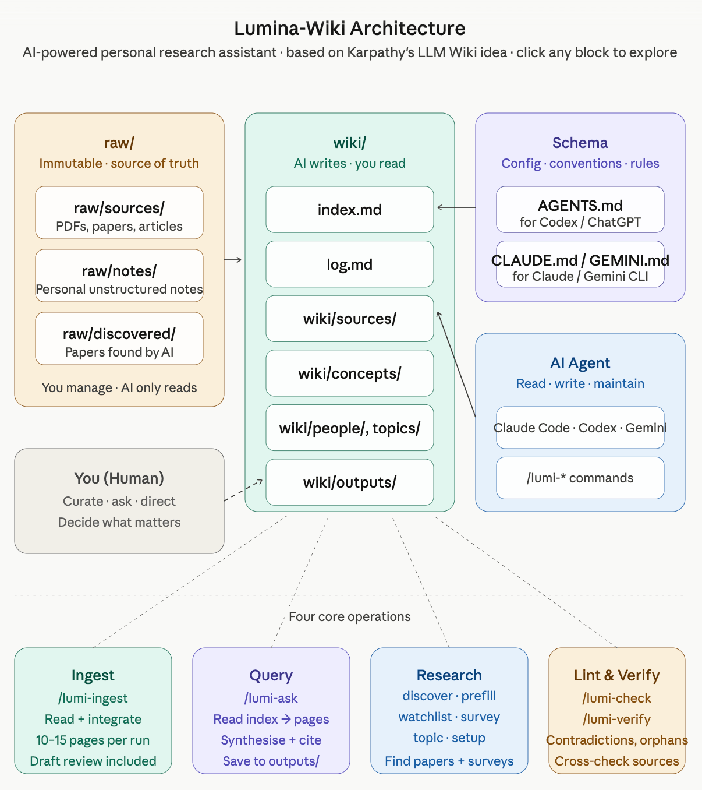
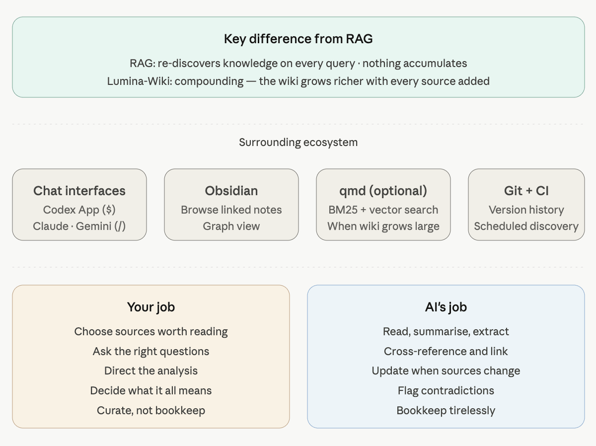

<p align="center" lang="en">
  
</p>

# Lumina-Wiki

> **Where Knowledge Starts to Glow.**
>
> Turn AI into your personal knowledge assistant and second brain.

<p align="center">
  
  
  
  
  <br>
  
  
  
  
</p>

<p align="center">
  English • <a href="README.vi.md" lang="vi">Tiếng Việt</a> • <a href="README.zh.md" lang="zh-Hans">简体中文</a>
</p>

<p align="center">
  <a href="docs/user-guide/en.md">User Guide</a>
</p>

<p align="center">
  <a href="https://www.youtube.com/watch?v=XuhhjbwoNeQ">
    
  </a>
  <br>
  <a href="https://www.youtube.com/watch?v=XuhhjbwoNeQ">▶ Watch the video walkthrough (Vietnamese)</a>
</p>

## Menu

- [Getting Started & Install](#2-getting-started)
- [User Guide](docs/user-guide/en.md)
- [The Core Workflow](#1-the-core-workflow)
- [Your First Commands](#3-your-first-commands-core-skills)
- [Workspace Directory Guide](#4-workspace-directory-guide)
- [Available Skills](#5-available-skills-v01)
- [What's Coming Next](#6-whats-coming-next)
- [Contributing & License](#7-contributing--license)
- [Other Languages](#8-other-languages)

---

## 1. The Core Workflow

Lumina-Wiki works from one simple principle: keep your raw materials separate from the AI's structured knowledge.

```text
+-------------------------+      /lumi-ingest      +---------------------------+
|      YOUR INPUT         | ---------------------> |     THE AGENT'S BRAIN     |
|       (raw/ folder)     |                        |       (wiki/ folder)      |
|                         | <--------------------- |                           |
|  - my-paper.pdf         |       /lumi-ask        |  - my-paper.md (summary)  |
|  - my-notes.txt         |                        |  - concept-a.md           |
+-------------------------+                        +---------------------------+
```

<p align="center">
  
</p>

1.  **You Provide:** Place your documents (PDFs, notes) in the `raw/` directory.
2.  **The Agent Builds:** Use commands in your AI chat, such as `/lumi-ingest`, to make the agent read from `raw/` and build a structured, interlinked wiki in `wiki/`.
3.  **You Query:** Ask questions with `/lumi-ask` against the agent's "brain" in `wiki/` for faster, more context-aware answers.

## 2. Getting Started

### **Step 1: Install**

Install the wiki workspace into your current project with one command:

Before running this command, your machine needs **Node.js**. If you do not have it yet, download and install the recommended version from the official site: [nodejs.org/en/download](https://nodejs.org/en/download).

```bash
npx lumina-wiki install
```

> **Note for Windows users:** For the best experience, enable [Developer Mode](https://learn.microsoft.com/en-us/windows/apps/get-started/enable-your-device-for-development) so the installer can use symlinks correctly. If Developer Mode is off, the installer falls back to copying skill files; everything still works, but updates are less ideal.

The installer will guide you through a quick setup, including optional **Packs** such as `research`, `reading`, and `learning`.

### **Step 2 (Optional): Configure the Research Pack**

If you installed the `research` pack, some skills can use API keys for better online search. In your AI chat, run:

> **You:**
> `/lumi-research-setup`

The agent will help you check the research tools and save keys to a local `.env` file when needed.

### **Step 3 (Upgrades): Migrate Legacy Wiki Entries**

If you reinstall Lumina-Wiki on a project that already has a `wiki/` from an earlier version, just run `npx lumina-wiki install` again. The installer updates scripts, schemas, and skills; **your content in `wiki/`, `raw/`, and `log.md` is not modified**.

You can run the command from the project root or one of its subfolders. If you remove a pack or AI tool from the setup, Lumina removes its old managed commands and unchanged setup files. Files you edited are kept with a warning. If the whole project was copied, moved, or renamed, Lumina repairs its managed links during the upgrade.

If the installer warns that older entries are missing newer frontmatter fields, you have two ways to backfill them:

- **Recommended:** open your AI chat and run `/lumi-migrate-legacy`.
- **Faster:** run this terminal command:

```bash
node _lumina/scripts/wiki.mjs migrate --add-defaults
```

See [`CHANGELOG.md`](CHANGELOG.md) or the local `_lumina/CHANGELOG.md` after install for version-by-version schema changes.

## 3. Your First Commands (Core Skills)

Interact with your wiki using these commands in your AI chat interface, such as Gemini CLI, Claude, or Codex.

**Phase 1: Ingest and Build Knowledge**
-   `/lumi-init`: Scan the `raw/` directory and perform the first wiki build.
-   `/lumi-ingest [path/to/file]`: Process a new document into the knowledge base. It asks you to review the draft, then keeps going unless something needs your judgment.

**Phase 2: Query and Maintain**
-   `/lumi-ask [your question]`: Ask a question against the full knowledge base in `wiki/`.
-   `/lumi-edit [path/to/wiki/page]`: Request a change or correction to a specific wiki page.
-   `/lumi-check`: Check the whole wiki for errors, such as broken links or orphan pages.

*Additional skills may be available if you installed optional packs such as `research`, `reading`, or `learning`.*

---

## 4. Workspace Directory Guide

Lumina creates a workspace where each folder has a clear purpose.

<p align="center">
  
</p>

| Path | Purpose | Managed By |
| :--- | :--- | :--- |
| **`raw/`** | **Your immutable input library.** The agent **only reads** from here. | **You** |
| `raw/sources/` | Place your primary documents, such as PDFs and articles, here. | You |
| `raw/notes/` | Your personal, unstructured notes and ideas. | You |
| `raw/assets/` | Images or other assets for your notes. | You |
| `raw/discovered/` | *(Research Pack)* Papers found by `/lumi-research-discover` are saved here. | Agent |
| **`wiki/`** | **The agent's brain.** The agent **writes** structured knowledge here. | **Agent** |
| `wiki/sources/` | AI-generated summaries for each document in `raw/sources`. | Agent |
| `wiki/concepts/` | Core ideas and definitions extracted into individual pages. | Agent |
| `wiki/people/` | Profiles of authors, researchers, and other people. | Agent |
| `wiki/outputs/` | Detailed answers from `/lumi-ask` saved for reference. | Agent |
| `wiki/index.md` | The main table of contents for your wiki. | Agent |
| `...` | *(Other entity folders such as `foundations/` and `characters/` appear with packs.)* | Agent |
| **`_lumina/`** | Lumina-managed engine, scripts, and configuration. | **System** |
| **`.agents/`** | Skills the agent can use. | **System** |

You usually work with `raw/` and read results in `wiki/`; you do not need to edit system folders.

### **Browse Your Wiki with Obsidian (Optional)**

[Obsidian](https://obsidian.md) is a local Markdown note-taking app that helps you browse linked notes. Because Lumina-Wiki also creates Markdown files, you can open the **project root folder** in Obsidian to read and browse your wiki more easily. See the [user guide](docs/user-guide/en.md#using-obsidian-to-read-the-wiki) for details.

### **Local Search with qmd (Advanced, Optional)**

As your wiki grows, you can use [qmd](https://github.com/tobi/qmd) for faster local Markdown search. If your IDE supports the skill format, install the official qmd skill with:

```bash
npx skills add https://github.com/tobi/qmd --skill qmd
```

See the [Advanced Guide](docs/user-guide/advanced-qmd.en.md) for detailed installation and configuration.

---

## 5. Available Skills

These are the commands you can use when chatting with your AI agent.

| Pack | Skill | Purpose |
| :--- | :--- | :--- |
| **Core** | `/lumi-init` | Initialize the wiki from all files in `raw/`. |
| | `/lumi-ingest` | Read a document and write a wiki page. It asks you to review the draft, then continues on its own unless something needs your judgment. Resumable across sessions. |
| | `/lumi-ask` | Ask a question against the full knowledge base. |
| | `/lumi-edit` | Request a manual edit to a wiki page. |
| | `/lumi-check` | Check the wiki for errors, such as broken links. |
| | `/lumi-reset` | Safely reset parts of the wiki. |
| | `/lumi-verify` | Check that wiki notes match the sources they cite. Reports anything suspicious for your review; never edits notes for you. |
| | `/lumi-help` | Read your workspace state and recommend one next action. Pass `skills` to list every command, or `explain <topic>` to ask how Lumina itself works (e.g., `/lumi-help explain bidirectional links`). |
| **Research** | `/lumi-research-discover` | Discover and rank relevant research papers. |
| | `/lumi-research-watchlist` | Choose research topics for scheduled discovery with AI help. |
| | `/lumi-research-survey` | Create a survey or summary from existing knowledge. |
| | `/lumi-research-prefill` | Seed foundational concepts to avoid duplicates. |
| | `/lumi-research-topic` | Create a topic page at `wiki/topics/<slug>.md` by gathering related concepts and sources already in your wiki. The AI proposes what to include and you confirm before anything is written. Use this after several `/lumi-ingest` runs when you want to give a theme its own page. |
| | `/lumi-research-rank` | Score a paper you have already ingested so you know what to read first. It looks up how influential the paper is (citation signals), estimates how respected its venue is, and rates its quality on four points — Correctness, Clarity, Contribution, and Context — then adds a clear scorecard to the paper's page. Measured numbers and the AI's own estimates are always kept separate. |
| | `/lumi-research-setup` | Help configure API keys for research tools. |
| | `/lumi-research-watch-run` | Run one scheduled-discovery pass over your watchlist (topics + RSS / Atom feeds). Polls only when you ask. |
| **Reading** | `/lumi-reading-chapter-ingest` | Ingest a book chapter by chapter. |
| | `/lumi-reading-character-track` | Track characters and their relationships in a story. |
| | `/lumi-reading-theme-map` | Identify and map themes in a narrative. |
| | `/lumi-reading-plot-recap` | Provide a progressive plot recap. |
| **Learning** | `/lumi-learning-reflect` | Guide a self-reflection session on a concept or source you have studied. Creates a personal reflection page in `wiki/reflections/` with a rewritable "Current understanding" section and an append-only "Evolution" log. The AI acts as a metacognitive mirror — it quotes your past words and asks questions — but never writes the reflection for you. |

The scripts behind these skills live in `_lumina/scripts/` and `_lumina/tools/`; you usually do not need to call them directly.

---

## 6. What's Coming Next

Lumina-Wiki is evolving rapidly. Here is our user-facing roadmap:

**Near-term (Stability & New Ingestion)**
- [x] **`/lumi-help` Skill:** A smart assistant that reads your workspace state and tells you the one thing to do next; `skills` shows every command, `explain <topic>` answers how Lumina itself works. *(shipped in v1.4)*
- [x] **Learning Pack:** Self-reflection sessions that track how your understanding of a concept evolves over time. *(shipped in v1.4)*
- [x] **Multilingual setup:** Choose English, Vietnamese, or Chinese as your primary language during install. *(shipped in v1.2)*
- [x] **Native DOCX, RTF & EPUB ingestion:** Pull Word, Rich Text, and EPUB books straight into your wiki via the research pack. *(shipped in v1.x)*
- [x] **Improved CI/CD:** Native support for Bun and Node 22 environments. *(shipped in v1.2)*
- [x] **Global Source Expansion:** Direct integration with OpenAlex, CORE, and Unpaywall for reliable DOI-to-PDF resolution. *(shipped in v1.6)*
- [x] **RSS & Blog Monitoring:** Automatically surface new papers from your favorite lab blogs and journals via `type: feed` watchlist items. *(shipped in v1.6)*
- [x] **Advanced Paper Ranking:** See influence scores and quality signals for your research papers via `/lumi-research-rank`. *(shipped in v1.7)*

**Long-term (Deep Research & Integration)**
- [ ] **Image OCR & Scanned PDFs:** Ingest screenshots and scanned PDFs into your wiki.
- [ ] **Paper Version Tracking:** Get notified when an already-ingested paper has a new revision or published version.
- [ ] **Google Workspace:** Ingest Google Docs and Sheets directly into your graph.
- [ ] **Multimedia Support:** Process YouTube videos and Audio recordings via transcripts.
- [ ] **Knowledge Graph Auditing:** Automated checks for contradictions and structural drift.

**Proposed**
- [ ] **Desktop Application:** A dedicated visual environment for easier wiki management.
- [ ] **Specialized Science Packs:** Deep integration for bio-medical and physics researchers.

---
*Full technical details are available in [`ROADMAP.md`](./ROADMAP.md). Want to contribute? Join us on GitHub!*

---

## 7. Contributing & License

### CLI Contract

CI scripts and integrations should reference [`docs/cli-contract.md`](./docs/cli-contract.md) for the v1.x stable flag list and exit code mapping. Anything not listed there is internal and may change without notice.

### Local Development (for contributors)

If you want to contribute to the `lumina-wiki` installer:

```bash
# 1. Clone and install dependencies
git clone https://github.com/tronghieu/lumina-wiki.git
cd lumina-wiki
npm ci

# 2. Run tests
npm run test:all
```

## 8. Other Languages

- [Tiếng Việt (Vietnamese)](README.vi.md)
- [简体中文 (Chinese)](README.zh.md)

**License:** [MIT](LICENSE) © Lưu Trọng Hiếu.

<!-- lumina:schema -->

## Roles

You are the wiki maintainer. The user curates sources, asks questions, and directs analysis. You do everything else: read, summarize, connect pages, file notes, run health checks, and keep the wiki coherent. You write the wiki; the user reads it.

Always communicate with the user in **English**. Always write wiki pages in **English**.

### User Communication

- Default to a clear, everyday style suitable for most users. You are a helpful knowledge assistant, not a software engineer explaining implementation details.
- Use **English** for every conversational message. Do not mix languages unless quoting source text, file names, commands, or proper nouns.
- Translate workflow terms into the user's language. If a source uses an important domain term, write the translated term first and put the original term in parentheses on first use.
- Speak to non-technical users. Use short, natural sentences. Say what the user gets, what changed, what needs attention, or what decision is needed; keep internal tool details quiet unless the user asks.
- Prefer plain phrases such as "checking links", "checking against the source", "saving the page", and "I found something to review" over tool-centric words like lint, schema, frontmatter, checkpoint, verify, or JSON in user-facing messages.
- If technical detail is necessary, give the plain-language meaning first, then the technical term in parentheses.
- Ask the user only when their judgment is needed: approving a draft, choosing between ambiguous sources, allowing an overwrite/restart, handling source-check findings, accepting lower confidence, or deciding how to fix an issue the tools cannot fix safely.

---

## Repository Layout

Keep this mental map in immediate context:

### `wiki/` is the main product surface

- `wiki/index.md` — catalog of all wiki pages, updated on every ingest
- `wiki/log.md` — append-only activity log
- `wiki/concepts/` — reusable knowledge structure
- `wiki/sources/` — per-source summaries (papers, articles, books, podcasts, notes)
- `wiki/people/` — people referenced across sources
- `wiki/summary/` — area-level syntheses
- `wiki/outputs/` — generated artifacts (comparisons, exports)
- `wiki/graph/` — derived state; never edit manually

### `raw/` is user-owned

- `raw/sources/` — `.pdf`, `.tex`, `.html`, `.md`, transcripts, anything ingested
- `raw/notes/` — user's own markdown notes
- `raw/assets/` — images and binary attachments
- `raw/tmp/` — sidecar files generated by skills (transient; do not store canonical sources here)
- `raw/download/<resource>/` — full-text artifacts auto-fetched by skills, partitioned by source
  (e.g. `raw/download/arxiv/2604.03501v2.pdf`, `raw/download/doi/<doi>.pdf`).
  Permanent agent-writable zone — keep separate from `raw/sources/` (human-curated).

**Rule:** never modify or delete an existing file under `raw/`. Files added by the user are authoritative and immutable to the agent. New files may only be *added*, only by a skill that documents this behavior, and only into `raw/tmp/`, `raw/download/`. Every other path under `raw/` is read-only.

### `.agents/` is the skill source of truth

- `.agents/skills/lumi-*/` — installed skills (flat, one directory per skill)

### `_lumina/` is the installer-managed sidecar

- `_lumina/config/lumina.config.yaml` — workspace config; editable
- `_lumina/schema/` — deeper reference docs; open when this file points you there
- `_lumina/scripts/` — Node engine (`wiki.mjs`, `lint.mjs`, `reset.mjs`, `schemas.mjs`)
- `_lumina/tools/` — Python tools (always: `extract_pdf.py`, `fetch_pdf.py`, `requirements.txt`)
- `_lumina/_state/` — installer/skill checkpoint state; gitignored
- `_lumina/manifest.json` — installer state; never edit by hand

---

## Page Types

Every wiki page has a defined type, frontmatter, and section structure. **Open `_lumina/schema/page-templates.md` before drafting a new page or repairing an existing one** — it has the full templates and required frontmatter fields.

| Type       | Directory      | Purpose                                                              |
|------------|---------------|----------------------------------------------------------------------|
| Source     | `sources/`    | Per-document summary: key claims, evidence, takeaways, questions     |
| Concept    | `concepts/`   | Cross-source idea or technique with variants and comparisons         |
| Person     | `people/`     | Profile of a referenced person with key sources and relationships    |
| Summary    | `summary/`    | Area-level synthesis spanning multiple sources and concepts          |

---

## Link Syntax

All internal links use Obsidian wikilinks:

```markdown
[[slug]]                     — link to any page in this wiki
[[chain-of-thought]]         — links to concepts/chain-of-thought.md
[[1984-orwell]]              — links to sources/1984-orwell.md
```

**Slug rule**: lowercase, hyphen-separated, no spaces, no diacritics.

---

## Cross-Reference Rules (Bidirectional Links)

When you write a forward link, **always write the reverse link in the same operation**. This is the heart of why the wiki compounds. Skipping it leaves the graph half-built.

| Forward action                              | Required reverse action                    |
|---------------------------------------------|---------------------------------------------|
| `sources/A` writes `Related: [[concept-B]]` | `concepts/B` appends A to `Key sources`    |
| `sources/A` writes `[[person-C]]`           | `people/C` appends A to `Key sources`      |
| `concepts/K` writes `[[source-E]]`          | `sources/E` appends K to `Related concepts`|
| `summary/S` writes `[[concept-K]]`          | `concepts/K` appends S to `Mentioned in`   |

### Exemptions (mode: `exempt-only`, default)

Some links are intentionally one-way. Defaults:

- **`outputs/**`** — ephemeral artifacts
- **External URLs** (`*://*`) — out of wiki scope

Anything outside an exemption glob must be bidirectional.

---

## Log Format

Append-only. One line per skill invocation. Format:

```markdown
## [YYYY-MM-DD] skill | details
```

`grep "^## \[" wiki/log.md | tail -10` gives you recent activity.

---

## Graph

`wiki/graph/edges.jsonl` and `wiki/graph/citations.jsonl` are auto-generated. Never edit manually. The full set of edge types lives in `_lumina/scripts/schemas.mjs` — open it when you need to pick a type or check what is allowed.

---

## Constraints (Non-Negotiable)

- **`raw/` is user-owned**: never modify or delete existing files; additions only via the two named paths above.
- **`graph/` is auto-generated**: only modify via the graph rebuild step.
- **Bidirectional links are mandatory**: forward link and reverse link in the same operation.
- **`index.md` updated on every ingest**: every new page must be cataloged immediately.
- **`log.md` is append-only**: never rewrite history.
- **Skill flags are user-owned**: never invent, flip, or drop a flag based on repo state alone. If the user omitted a parameter, only fill it in when the skill explicitly documents a default; otherwise ask.
- **No silent overwrites**: preserve sections marked with `<!-- user-edited -->` comment.
- **Cite when uncertain**: link the source explicitly for low-confidence claims.

---

## Skills

Skills live in `.agents/skills/` and are invoked via slash commands. Active install recorded in `_lumina/manifest.json`.

### Core skills (always present)

| Skill         | Trigger        | What it does                                          |
|---------------|---------------|-------------------------------------------------------|
| `/lumi-init`   | manual, first  | Bootstrap wiki from existing `raw/` content          |
| `/lumi-ingest` | manual         | Read a source and write a wiki page. It asks you to review the draft, then continues on its own unless something needs your judgment |
| `/lumi-ask`    | manual         | Query wiki, synthesize answer, optionally file page   |
| `/lumi-edit`   | manual         | Add/remove/revise wiki content per user request       |
| `/lumi-check`  | manual/weekly  | Lint: broken links, orphans, missing reverse links    |
| `/lumi-reset`  | manual         | Scoped destructive cleanup                            |
| `/lumi-verify` | manual         | Check that wiki pages match the sources they cite; reports suspicious statements for the user to review; never auto-edits                            |


---

## Tooling Conventions

- **`_lumina/scripts/lint.mjs`** — pure-Node markdown linter, runs offline.
- **`_lumina/scripts/wiki.mjs`** — wiki engine (frontmatter, graph mutation, slug, log).
- **`_lumina/scripts/reset.mjs`** — scoped destructive reset.
- **`_lumina/tools/extract_pdf.py`** — PDF text extractor (pypdf-based); used by `/lumi-ingest` and `/lumi-reading-chapter-ingest` when the host IDE cannot read PDFs natively.
- **`_lumina/tools/fetch_pdf.py`** — URL → `raw/download/<resource>/` PDF downloader (streaming, atomic, idempotent); used by `/lumi-ingest` Mode B when the input is a URL or paper identifier.
- **`_lumina/tools/requirements.txt`** — Python dependencies for bundled tools. Run `pip install -r _lumina/tools/requirements.txt` when a tool reports a missing package.

---

## How To Use This Wiki (For New LLM Sessions)

1. Read this file (you are doing it now).
2. Read `wiki/index.md` to learn what already exists.
3. Read `wiki/log.md`'s last 20 entries to learn what happened recently.
4. When the user invokes a skill, read the skill's `SKILL.md` first.
5. When in doubt about page structure, open `_lumina/schema/page-templates.md`.
6. When in doubt about scope, ask the user — never silently expand it.

The wiki is a long-running collaboration. Maintain it patiently.

<!-- /lumina:schema -->

---

## Contributors

Thanks to everyone who has contributed to Lumina Wiki!

[](https://github.com/tronghieu/lumina-wiki/graphs/contributors)

**Want to contribute?** Read [CONTRIBUTING.md](CONTRIBUTING.md) to get started — bug reports, new skills, tool integrations, and translations are all welcome.
