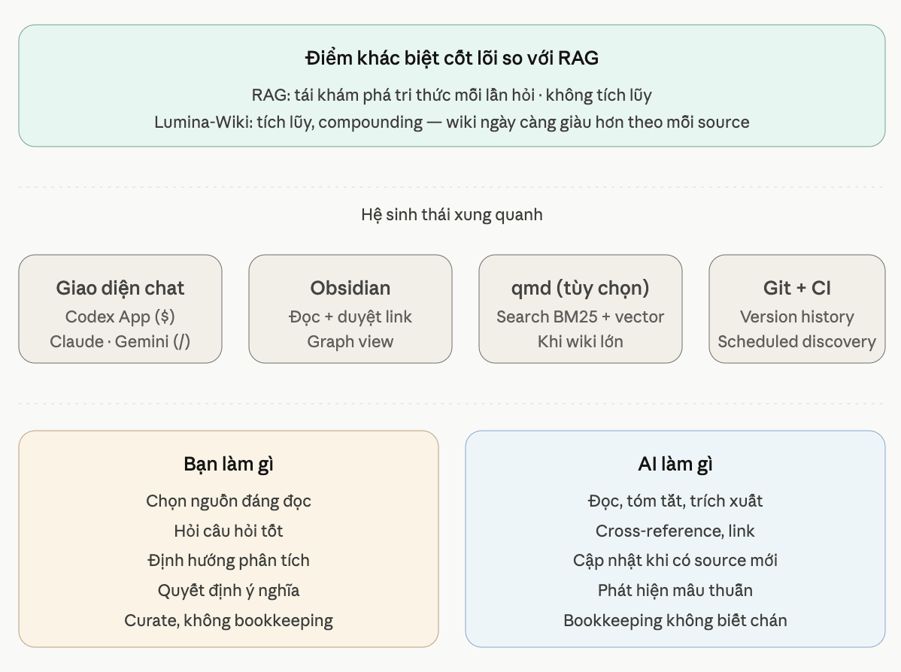

<p align="center" lang="vi">
  
</p>

# Lumina-Wiki

> **Where Knowledge Starts to Glow.**
>
> Biến AI thành trợ lý tri thức cá nhân và bộ não thứ hai của bạn.

<p align="center">
  
  
  
  
  <br>
  
  
  
  
</p>

<p align="center">
  <a href="README.md" lang="en">English</a> • Tiếng Việt • <a href="README.zh.md" lang="zh-Hans">简体中文</a>
</p>

<p align="center">
  <a href="docs/user-guide/vi.md">Hướng dẫn sử dụng</a>
</p>

## Menu

- [Bắt đầu & Cài đặt](#2-bắt-đầu)
- [Hướng dẫn sử dụng](docs/user-guide/vi.md)
- [Luồng làm việc cốt lõi](#1-luồng-làm-việc-cốt-lõi)
- [Các lệnh đầu tiên](#3-các-lệnh-đầu-tiên-của-bạn-kỹ-năng-cốt-lõi)
- [Cấu trúc thư mục](#4-hướng-dẫn-cấu-trúc-thư-mục)
- [Các kỹ năng có sẵn](#5-các-kỹ-năng-có-sẵn-v01)
- [Lộ trình sắp tới](#6-lộ-trình-sắp-tới)
- [Đóng góp & Giấy phép](#7-đóng-góp--giấy-phép)
- [Ngôn ngữ khác](#8-ngôn-ngữ-khác)

---

## 1. Luồng làm việc cốt lõi

Lumina-Wiki hoạt động dựa trên một nguyên tắc đơn giản: tách biệt tài liệu thô của bạn khỏi khối kiến thức có cấu trúc của AI.

```text
+-------------------------+      /lumi-ingest      +---------------------------+
|      ĐẦU VÀO CỦA BẠN    | ---------------------> |      BỘ NÃO CỦA AGENT     |
|    (Thư mục raw/)       |                        |     (Thư mục wiki/)       |
|                         | <--------------------- |                           |
|  - bai-bao.pdf          |       /lumi-ask        |  - bai-bao.md (tóm tắt)   |
|  - ghi-chu.txt          |                        |  - khai-niem-a.md         |
+-------------------------+                        +---------------------------+
```

<p align="center">
  
</p>

1.  **Bạn Cung cấp:** Đặt các tài liệu (PDF, ghi chú) của bạn vào thư mục `raw/`.
2.  **Agent Xây dựng:** Sử dụng các lệnh trong cuộc hội thoại với AI (như `/lumi-ingest`) để yêu cầu agent đọc từ `raw/` và xây dựng một wiki có cấu trúc, liên kết chặt chẽ trong thư mục `wiki/`.
3.  **Bạn Khai thác:** Đặt câu hỏi (sử dụng `/lumi-ask`) trực tiếp vào "bộ não" của agent trong `wiki/` để nhận được câu trả lời nhanh và phù hợp với ngữ cảnh hơn.

## 2. Bắt đầu

### **Bước 1: Cài đặt**

Cài đặt không gian làm việc wiki vào dự án hiện tại của bạn bằng một lệnh duy nhất:

Trước khi chạy lệnh này, máy tính của bạn cần có **Node.js**. Nếu chưa có, hãy tải và cài bản khuyến nghị từ trang chính thức: [nodejs.org/en/download](https://nodejs.org/en/download).

```bash
npx lumina-wiki install
```

> **Lưu ý cho người dùng Windows:** Để có trải nghiệm tốt nhất, bạn nên [bật Chế độ nhà phát triển (Developer Mode)](https://learn.microsoft.com/vi-vn/windows/apps/get-started/enable-your-device-for-development) để trình cài đặt có thể sử dụng symlink một cách chính xác. Nếu Developer Mode bị tắt, trình cài đặt sẽ chuyển sang sao chép các file skill; chức năng vẫn hoạt động nhưng sẽ không lý tưởng bằng cho việc cập nhật.

Trình cài đặt sẽ hướng dẫn bạn qua một vài bước thiết lập nhanh, bao gồm cả việc lựa chọn các **Gói (Packs)** tùy chọn như `research` (nghiên cứu), `reading` (đọc hiểu) và `learning` (học tập).

### **Bước 2 (Tùy chọn): Cấu hình Gói Research**

Nếu bạn đã cài đặt gói `research`, một số kỹ năng có thể dùng API key để tìm kiếm trực tuyến tốt hơn. Trong cuộc trò chuyện với AI, chạy:

> **Bạn:**
> `/lumi-research-setup`

Agent sẽ hướng dẫn bạn kiểm tra công cụ nghiên cứu và lưu key vào file `.env` cục bộ khi cần.

### **Bước 3 (Khi nâng cấp): Migrate các entry wiki cũ**

Nếu bạn cài lại Lumina-Wiki trên một dự án đã có `wiki/` từ phiên bản trước, cứ chạy lại `npx lumina-wiki install`. Installer cập nhật scripts, schemas và skills; **nội dung của bạn trong `wiki/`, `raw/`, `log.md` không bị chỉnh sửa**.

Nếu installer cảnh báo entry cũ thiếu frontmatter mới, có hai cách backfill:

- **Khuyến nghị:** mở chat AI và chạy `/lumi-migrate-legacy`.
- **Nhanh hơn:** chạy terminal command:

```bash
node _lumina/scripts/wiki.mjs migrate --add-defaults
```

Xem [`CHANGELOG.md`](CHANGELOG.md) hoặc bản local `_lumina/CHANGELOG.md` sau khi cài để biết chi tiết thay đổi schema theo phiên bản.

## 3. Các lệnh đầu tiên của bạn (Kỹ năng cốt lõi)

Tương tác với wiki của bạn bằng cách sử dụng các lệnh này trong giao diện trò chuyện với AI Agent (ví dụ: Gemini CLI, Claude, v.v.).

**Giai đoạn 1: Nạp và Xây dựng kiến thức**
-   `/lumi-init`: Quét thư mục `raw/` và thực hiện xây dựng wiki lần đầu.
-   `/lumi-ingest [đường/dẫn/tới/file]`: Đưa một tài liệu mới vào wiki. AI cho bạn xem bản nháp trước, rồi tự tiếp tục nếu không có điểm cần bạn quyết định.

**Giai đoạn 2: Khai thác và Bảo trì**
-   `/lumi-ask [câu hỏi của bạn]`: Đặt câu hỏi dựa trên toàn bộ cơ sở kiến thức trong `wiki/`.
-   `/lumi-edit [đường/dẫn/tới/trang/wiki]`: Yêu cầu thay đổi hoặc sửa lỗi cho một trang wiki cụ thể.
-   `/lumi-check`: Kiểm tra toàn bộ wiki để tìm lỗi (liên kết hỏng, trang mồ côi, v.v.).

*Các kỹ năng bổ sung có thể có sẵn nếu bạn đã cài đặt các gói tùy chọn như `research`, `reading` hoặc `learning`.*

---

## 4. Hướng dẫn cấu trúc thư mục

Lumina tạo ra một không gian làm việc với mục đích rõ ràng cho từng thư mục.

<p align="center">
  
</p>

| Đường dẫn | Mục đích | Quản lý bởi |
| :--- | :--- | :--- |
| **`raw/`** | **Thư viện đầu vào bất biến của bạn.** Agent **chỉ đọc** từ đây. | **Bạn** |
| `raw/sources/` | Đặt các tài liệu chính của bạn (PDF, bài báo) tại đây. | Bạn |
| `raw/notes/` | Các ghi chú, ý tưởng cá nhân chưa có cấu trúc của bạn. | Bạn |
| `raw/assets/` | Hình ảnh hoặc các tài sản khác cho ghi chú của bạn. | Bạn |
| `raw/discovered/`| *(Gói Research)* Các bài báo do `/lumi-research-discover` tìm thấy sẽ được lưu ở đây. | Agent |
| **`wiki/`** | **Bộ não của Agent.** Agent **ghi** kiến thức có cấu trúc vào đây. | **Agent** |
| `wiki/sources/` | Các bản tóm tắt do AI tạo cho mỗi tài liệu trong `raw/sources`. | Agent |
| `wiki/concepts/` | Các ý tưởng, định nghĩa cốt lõi được trích xuất thành các trang riêng lẻ. | Agent |
| `wiki/people/` | Hồ sơ của các tác giả, nhà nghiên cứu, v.v. | Agent |
| `wiki/outputs/` | Các câu trả lời chi tiết từ `/lumi-ask` được lưu lại để tham khảo. | Agent |
| `wiki/index.md` | Bảng mục lục chính cho toàn bộ wiki của bạn. | Agent |
| `...` | *(Các thư mục thực thể khác như `foundations/`, `characters/` xuất hiện cùng các gói)* | Agent |
| **`_lumina/`** | Engine, script và cấu hình do Lumina quản lý. | **Hệ thống** |
| **`.agents/`** | Các skill mà agent có thể dùng. | **Hệ thống** |

Bạn thường chỉ làm việc với `raw/` và đọc kết quả trong `wiki/`; không cần sửa thư mục hệ thống.

### **Duyệt Wiki với Obsidian (Tùy chọn)**

[Obsidian](https://obsidian.md) là ứng dụng ghi chú lưu ghi chú dưới dạng file Markdown trên máy và giúp bạn liên kết các ghi chú với nhau. Vì Lumina-Wiki cũng tạo file Markdown, bạn có thể mở **thư mục gốc của project** bằng Obsidian để đọc và duyệt wiki dễ hơn. Xem thêm trong [hướng dẫn sử dụng](docs/user-guide/vi.md#dùng-obsidian-để-đọc-wiki).

### **Tìm kiếm cục bộ với qmd (Nâng cao, tùy chọn)**

Khi wiki lớn dần, bạn có thể dùng [qmd](https://github.com/tobi/qmd) để tìm kiếm Markdown cục bộ nhanh hơn. Nếu IDE của bạn hỗ trợ skill format, có thể cài skill qmd chính thức bằng:

```bash
npx skills add https://github.com/tobi/qmd --skill qmd
```

Xem [Hướng dẫn Nâng cao](docs/user-guide/advanced-qmd.vi.md) để biết chi tiết cài đặt và cấu hình.

---

## 5. Các kỹ năng có sẵn

Đây là những lệnh bạn có thể sử dụng khi trò chuyện với AI.

| Gói | Skill | Mục đích |
| :--- | :--- | :--- |
| **Core** | `/lumi-init` | Khởi tạo wiki từ tất cả các file trong `raw/`. |
| | `/lumi-ingest` | Đọc một tài liệu và viết trang wiki. AI cho bạn xem bản nháp trước, rồi tự tiếp tục nếu không có điểm cần bạn quyết định. Có thể tiếp tục giữa các phiên. |
| | `/lumi-ask` | Đặt câu hỏi dựa trên toàn bộ cơ sở kiến thức. |
| | `/lumi-edit` | Yêu cầu chỉnh sửa thủ công một trang wiki. |
| | `/lumi-check` | Kiểm tra lỗi trong wiki (liên kết hỏng, v.v.). |
| | `/lumi-reset` | Xóa các phần của wiki một cách an toàn. |
| | `/lumi-verify` | Kiểm tra xem các trang wiki có khớp với nguồn đã trích dẫn không. Báo cáo những điểm đáng ngờ để bạn xem xét; không tự sửa ghi chú giúp bạn. |
| | `/lumi-help` | Đọc trạng thái workspace và đề xuất một bước tiếp theo. Gõ `/lumi-help skills` để xem toàn bộ danh sách lệnh, hoặc `/lumi-help explain <chủ đề>` để hỏi Lumina hoạt động ra sao (ví dụ `/lumi-help explain bidirectional links`). |
| **Research**| `/lumi-research-discover` | Khám phá và xếp hạng các bài báo nghiên cứu liên quan. |
| | `/lumi-research-watchlist` | Giúp bạn chọn các chủ đề nghiên cứu để AI tìm định kỳ. |
| | `/lumi-research-survey` | Tạo một bài tổng quan/khảo sát từ kiến thức hiện có. |
| | `/lumi-research-prefill` | Tạo trước các khái niệm nền tảng để tránh trùng lặp. |
| | `/lumi-research-topic` | Gom các khái niệm và nguồn liên quan trong wiki thành một trang chủ đề tại `wiki/topics/<slug>.md`. AI đề xuất danh sách để bạn xem và xác nhận trước khi trang được tạo. Dùng sau khi đã nạp nhiều tài liệu và muốn tổng hợp một nhóm ý tưởng thành trang riêng. |
| | `/lumi-research-setup` | Giúp cấu hình API key cho các công cụ nghiên cứu. |
| | `/lumi-research-watch-run` | Chạy một lượt khám phá theo lịch dựa trên watchlist (chủ đề + nguồn RSS / Atom). Chỉ chạy khi bạn yêu cầu. |
| **Reading** | `/lumi-reading-chapter-ingest`| Nạp kiến thức sách theo từng chương. |
| | `/lumi-reading-character-track`| Theo dõi các nhân vật và mối quan hệ của họ trong truyện. |
| | `/lumi-reading-theme-map` | Xác định và lập bản đồ các chủ đề trong một câu chuyện. |
| | `/lumi-reading-plot-recap` | Cung cấp một bản tóm tắt tuần tự của cốt truyện. |
| **Learning** | `/lumi-learning-reflect` | Hướng dẫn một buổi phản tư (self-reflection) về một khái niệm hoặc tài liệu bạn đã học. Tạo trang phản tư cá nhân trong `wiki/reflections/` với phần "Hiểu biết hiện tại" có thể chỉnh sửa và nhật ký "Quá trình phát triển" chỉ được ghi thêm (không xóa). AI đóng vai trò gương nhận thức — trích dẫn lại lời bạn và đặt câu hỏi — nhưng không bao giờ viết nội dung phản tư thay bạn. |

Các script chạy nền nằm trong `_lumina/scripts/` và `_lumina/tools/`; thông thường bạn không cần gọi trực tiếp.

---

## 6. Lộ trình sắp tới

Lumina-Wiki đang phát triển nhanh chóng. Dưới đây là lộ trình hướng tới người dùng của chúng tôi:

**Sắp tới (Ổn định & Mở rộng nạp tài liệu)**
- [x] **Kỹ năng `/lumi-help`:** Trợ lý thông minh đọc trạng thái workspace và mách bạn bước tiếp theo; gõ `/lumi-help skills` để xem toàn bộ lệnh, hoặc `/lumi-help explain <chủ đề>` để hỏi Lumina hoạt động ra sao. *(đã phát hành trong v1.4)*
- [x] **Gói Learning:** Các buổi phản tư cá nhân giúp bạn theo dõi sự tiến triển trong hiểu biết về một khái niệm theo thời gian. *(đã phát hành trong v1.4)*
- [x] **Cài đặt đa ngôn ngữ:** Chọn Tiếng Anh, Tiếng Việt hoặc Tiếng Trung làm ngôn ngữ chính khi cài đặt. *(đã phát hành trong v1.2)*
- [x] **Nạp DOCX, RTF & EPUB native:** Đưa thẳng file Word, Rich Text và sách EPUB vào wiki qua research pack. *(đã phát hành trong v1.x)*
- [x] **Cải thiện CI/CD:** Hỗ trợ chính thức cho môi trường Bun và Node 22. *(đã phát hành trong v1.2)*
- [x] **Mở rộng nguồn dữ liệu toàn cầu:** Tích hợp trực tiếp với OpenAlex, CORE và Unpaywall để tra cứu DOI-to-PDF đáng tin cậy. *(ra mắt trong v1.6)*
- [x] **Theo dõi RSS & Blog:** Tự động phát hiện bài báo mới từ các blog phòng thí nghiệm và tạp chí yêu thích qua các mục `type: feed` trong watchlist. *(ra mắt trong v1.6)*
- [ ] **Xếp hạng bài báo nâng cao:** Xem điểm số ảnh hưởng và tín hiệu chất lượng cho các nghiên cứu của bạn.

**Dài hạn (Nghiên cứu sâu & Tích hợp)**
- [ ] **OCR ảnh & PDF scan:** Nạp ảnh chụp màn hình và PDF dạng scan vào wiki.
- [ ] **Theo dõi phiên bản bài báo:** Nhận thông báo khi một bài báo đã nạp có bản sửa đổi hoặc phiên bản xuất bản chính thức mới.
- [ ] **Google Workspace:** Nạp trực tiếp Google Docs và Sheets vào đồ thị tri thức.
- [ ] **Hỗ trợ đa phương tiện:** Xử lý video YouTube và ghi âm Audio thông qua transcript.
- [ ] **Kiểm định đồ thị tri thức:** Tự động phát hiện mâu thuẫn và sai lệch cấu trúc.

**Dự kiến**
- [ ] **Ứng dụng Desktop:** Môi trường giao diện chuyên dụng để quản lý wiki dễ dàng hơn.
- [ ] **Gói Khoa học Chuyên dụng:** Tích hợp sâu cho các nhà nghiên cứu sinh học, y tế và vật lý.

---
*Chi tiết kỹ thuật đầy đủ có tại [`ROADMAP.md`](./ROADMAP.md). Bạn muốn đóng góp? Hãy tham gia cùng chúng tôi trên GitHub!*

---

## 7. Đóng góp & Giấy phép

### Hợp đồng CLI

Script CI và tích hợp nên tham chiếu [`docs/cli-contract.md`](./docs/cli-contract.md) để biết danh sách cờ ổn định và mapping exit code cho v1.x. Bất cứ thứ gì không liệt kê trong đó đều là nội bộ và có thể đổi mà không báo trước.

### Phát triển cục bộ (dành cho người đóng góp)

Nếu bạn muốn đóng góp cho trình cài đặt `lumina-wiki`:
```bash
# 1. Clone & Cài đặt Dependencies
git clone https://github.com/tronghieu/lumina-wiki.git
cd lumina-wiki
npm ci

# 2. Chạy Tests
npm run test:all
```

## 8. Ngôn ngữ khác

- [English (Tiếng Anh)](README.md)
- [简体中文 (Tiếng Trung)](README.zh.md)

**Giấy phép:** [MIT](LICENSE) © Lưu Trọng Hiếu.
