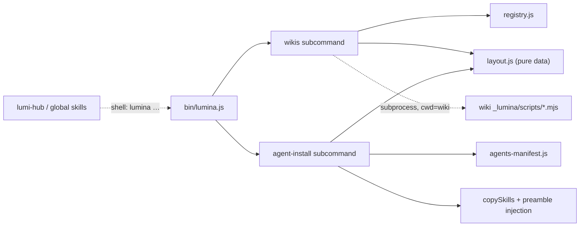
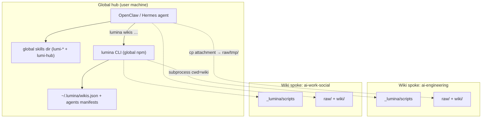

# Architecture Spine — librarian-mode

## Design Paradigm

**Hub-and-spoke over file contracts.** One global hub per machine — the registry (`~/.lumina/`), the platform's global skills directory, and the `lumina` CLI — serving N fully self-contained wiki spokes. Every hub→spoke interaction crosses the boundary in exactly one of three ways: subprocess (`cd <wiki> && node _lumina/scripts/*.mjs`), new-file addition under `raw/`, or plain reads. No imports across the boundary, no shared in-memory state, no spoke→hub dependency. Extends the existing single-source projection installer + thin-CLI-toolbelt architecture; the named brownfield change sites are `copySkills` (gains the preamble-injection step) and `uninstallCommand` (loses its whole-directory wipe).

## Inherited Invariants

Binding, read-only; from `docs/project-context.md` §3 (PC) and the locked v0.1 architecture (ADD). Never re-derived here.

| Inherited | From | Binds here |
| --- | --- | --- |
| atomicWrite for every write; safePath for relative fragments | PC §3.1–2 | registry, manifests, all new writers |
| Exit-code contract 0/1/2/3/4; JSON to stdout, `{error,code}` to stderr | PC §3.7 | every new subcommand |
| Lazy imports; cold-start < 300 ms | PC §3.8 | `wikis` / agent-install subcommands |
| No native modules, no postinstall, `devDependencies` empty | PC §3.4–5 | all new code and tests |
| `raw/` additions-only; `wiki.mjs` sole graph mutator; append-only `log.md` | PC §3.9–15 | chat inbox flow, doctor, hub skill |
| Idempotency CI gate (byte-diff on second install) | PC §7 | classic installs must stay byte-identical |
| Plain-language rule for user-facing text; multi-language docs sync; no emoji | PC §3.21/18/24 | prompts, acknowledgment notice, hub skill |
| Single source-of-truth projection; `schemas.mjs` pure data; skills call tools via Bash only | ADD v0.1 | skill projection, layout data, hub skill |
| Zero telemetry; LoC soft cap 3,000 original JS | PC §3.22–23 | registry/doctor modules stay lean |
| `/lumi-verify` (shipped v0.9) owns the word "verify" = semantic fact-checking of wiki content | skill inventory | no new surface may reuse "verify" for anything else |

## Invariants & Rules

### AD-1 — Hub–spoke boundary

- **Binds:** all
- **Prevents:** global tooling coupling to one engine version; cross-wiki writes; a "shortcut" import of a wiki's scripts.
- **Rule:** The global layer touches a wiki only via (a) subprocess with `cwd` set to that wiki, (b) new-file additions under `raw/tmp/`|`raw/discovered/`, (c) reads. Spokes never reference the hub.

### AD-2 — Hub state: one owner module per file

- **Binds:** CAP-1, CAP-2, CAP-3, CAP-5, CAP-8, CAP-9, CAP-10
- **Prevents:** competing writers; ad-hoc JSON parsing of hub state; the agents manifest ending up ownerless or double-owned.
- **Rule:** `src/installer/registry.js` `[ASSUMPTION: filename]` is the sole reader/writer of `~/.lumina/wikis.json`. `src/installer/agents-manifest.js` `[ASSUMPTION: filename]` is the sole reader/writer of `~/.lumina/agents/<platform>-manifest.json`, schema `{version: 1, platform, skills: [canonicalId], installedAt}`. Both use atomicWrite, `os.homedir()`, the `LUMINA_HOME` override, and a refuse-newer `version` guard. Command code and `lumi-hub` mutate hub state only through these modules / the CLI.

### AD-3 — Resolver is deterministic; the model does the semantics

- **Binds:** CAP-1, CAP-2, CAP-6, CAP-10
- **Prevents:** write-side keys and read-side matching diverging (the "kỹ thuật AI" silent non-match); fuzzy matching creeping into the CLI; alias collisions surfacing only at resolve time.
- **Rule:** One shared `normalizeKey()` exported from the registry module — NFC → casefold → diacritic-strip → kebab — is used both to compute stored keys at `add` time and to normalize stored key/name/aliases in every `resolve` comparison (never compare a normalized query against a raw stored value). Match priority key > name > aliases; zero or multiple matches exit 2 with candidates in the JSON error. `add` rejects (exit 1) a name/alias that already resolves to a different wiki. Topic/semantic selection happens only in the model over `wikis list` output.

### AD-4 — Version-correct engine invocation

- **Binds:** CAP-4, CAP-5, CAP-6, CAP-7
- **Prevents:** running the hub's (newer) engine against a wiki on an older schema.
- **Rule:** Any per-wiki operation launched from the global layer executes that wiki's own `_lumina/scripts/*.mjs` as a subprocess with `cwd` inside the wiki — never a repo or hub copy of the engine.

### AD-5 — Canonical layout has one definition, tied to reality

- **Binds:** CAP-3, CAP-4, CAP-5
- **Prevents:** install, doctor, and repair each hard-coding their own idea of a conforming wiki; `layout.js` silently drifting from what install actually produces.
- **Rule:** The required directory/skeleton list is pure data exported from one installer-side module `[ASSUMPTION: src/installer/layout.js]`; install, doctor check, and doctor fix all consume it. A colocated `layout.test.js` performs a real sandbox install and fails when layout data and installer output disagree.

### AD-6 — Repair is additive-only and installer-faithful

- **Binds:** CAP-4, CAP-5
- **Prevents:** doctor becoming a second writer that mutates wiki content; repaired wikis existing in a state the installer would never produce (blank `log.md` breaking lint).
- **Rule:** Fix mode may only create paths named by the layout data that are missing: directories via mkdir; files by invoking the installer's own template render for exactly those paths with default variables — never a hand-written blank file. An existing path is never opened for write (exists→skip), proven by a byte-identical test on pre-existing files.

### AD-7 — Skill projection: literal injection, never templating

- **Binds:** CAP-6, CAP-8
- **Prevents:** the template engine blanking live `{{…}}` placeholders that shipped skill bodies contain (e.g. `/lumi-verify`'s `{{ENTRY_TEXT}}`); preamble copies drifting; agent-host content leaking into classic installs; symlinks into foreign-owned global dirs.
- **Rule:** SKILL.md files are never passed through the template engine. Agent-host projection substitutes the canonical opening line ("Read `README.md` at the project root before this SKILL.md.") with the rendered routing-preamble partial `[ASSUMPTION: src/templates/partials/librarian-preamble.md]` — one literal, line-anchored replacement performed by the (new) injection step in `copySkills`; the preamble ends with its own "read the resolved wiki's README" step. Classic installs remain byte-copy. Global skill installs are plain `copyDir` — no symlink ladder. A new CI gate `[ASSUMPTION: scripts/ci-agent-host-isolation.mjs]`, separate from `ci-idempotency.mjs`, renders with and without agent targets and fails on any byte difference in classic output or any lost `{{…}}` placeholder.

### AD-8 — Ownership-manifest deletion rule

- **Binds:** CAP-8, CAP-9
- **Prevents:** the shipped wipe-the-directory defect — `src/installer/commands.js::uninstallCommand`'s unconditional recursive `rm` of `.agents/` — and its recurrence in the new global paths.
- **Rule:** Every skills-writing path (install, upgrade, uninstall, deselect; project and global) derives its owned set from a manifest (project: `skills-manifest.csv`; global: the AD-2 agents manifest) and deletes only owned-and-deselected canonicalIds, mirroring the existing lumi-prefix-filtered `.claude/skills` loop. Whole-directory deletes of any skills dir are banned; `uninstallCommand` is a named change site. Foreign entries are untouchable, proven by test. Global deselect reconciliation mirrors `reconcileRemovedIdeTargets` (detail deferred to the epic).

### AD-9 — CLI & ship surface

- **Binds:** CAP-1, CAP-5, CAP-8
- **Prevents:** cold-start regression; agent targets bleeding into IDE-target config; new modules passing local tests but missing from the published tarball.
- **Rule:** `wikis` and agent-install verbs are lazy-loaded subcommand modules registered in `bin/lumina.js`. `VALID_AGENT_TARGETS` is a separate set from `VALID_IDE_TARGETS`; agent-target selection is never persisted into a project's `lumina.config.yaml`. package.json's `files` allowlist (individually enumerated) gains every new installer module, and `ci-package.mjs`'s required-present list gains matching entries; test files stay excluded.

### AD-10 — `lumi-hub` goes through the CLI

- **Binds:** CAP-10
- **Prevents:** the hub skill (or a platform's self-generated skill) bypassing the registry contract; stories inventing divergent pre-resolution language behavior.
- **Rule:** `lumi-hub` operates exclusively through `lumina wikis` commands — never direct file access to hub state, never direct writes into a wiki outside the AD-1 channels. Before any wiki is resolved, hub replies mirror the language of the user's chat message; once a wiki is resolved, that wiki's configured `communication_language` governs. The registry carries no language field.

### AD-11 — Contract extension `[ADOPTED]`

- **Binds:** all new subcommands
- **Prevents:** a second error/output dialect; `lumi-hub` prose guessing at doctor's field names.
- **Rule:** New subcommands reuse the existing JSON/exit contract verbatim. Doctor's aggregated report shape is part of this contract: `{schemaVersion: 1, wikis: [{key, path, reachable, hasManifest, structureOk, lintOk, issues: []}]}`.



Arrows are the only permitted dependency directions; anything else is a violation.

## Consistency Conventions

| Concern | Convention |
| --- | --- |
| Naming | Registry keys via `normalizeKey()`; canonicalIds and CLI verbs kebab-case; new skill `lumi-hub`. Verb set: `add / remove / list / resolve / doctor` — no `verify`. |
| Data & formats | Registry schema `{version: 1, wikis: {...}}`; ISO-8601 UTC timestamps; `--json` envelopes match existing `wiki.mjs` style; forbidden field name `topics`; `packs` is a cache — refreshed from the live wiki manifest as a side effect of every successful `resolve`, advisory otherwise. |
| Paths | Home via `os.homedir()` + `path.join` only (Windows-safe); wiki paths stored absolute; relative fragments still go through `safePath`. |
| State & errors | All writes atomic; registry last-writer-wins (no locking, per spec non-goal); errors are plain text naming the offending path. |
| Tests | Colocated `node --test` files per new module (`registry.test.js`, `wikis-command.test.js`, `layout.test.js`, `agents-manifest.test.js`); no CI-matrix changes. |
| User-facing text | Plain-language rule 21; acknowledgment notice per language rules; en/vi/zh docs updated together. |

## Stack

Unchanged — no new dependencies. Inherited pins (verified against `package.json`, nothing new to research): Node ≥20 ESM, commander ^12.1.0, @clack/prompts ^0.9.1, js-yaml ^4.1.0, glob ^11.0.0, picocolors ^1.1.1; `node --test` + pytest.

## Structural Seed

```text
src/installer/
  registry.js            # [ASSUMPTION] wikis.json I/O + normalizeKey() — sole owner (AD-2/3)
  agents-manifest.js     # [ASSUMPTION] global per-platform manifest I/O — sole owner (AD-2)
  wikis-command.js       # [ASSUMPTION] add/remove/list/resolve/doctor
  layout.js              # [ASSUMPTION] canonical wiki layout, pure data (AD-5) + layout.test.js
  commands.js            # CHANGE SITE: copySkills (injection step), uninstallCommand (AD-8)
src/skills/agents/hub/   # [ASSUMPTION] lumi-hub source subtree
src/templates/partials/
  librarian-preamble.md  # [ASSUMPTION] the one routing-preamble source (AD-7)
scripts/
  ci-agent-host-isolation.mjs  # [ASSUMPTION] AD-7's cross-target CI gate
package.json             # CHANGE SITE: files allowlist (AD-9)
```

Runtime surface (user machine, not in repo): `~/.lumina/wikis.json`, `~/.lumina/agents/<platform>-manifest.json`, platform global skills directories per `platform-integration.md`.



## Capability → Architecture Map

| Capability | Lives in | Governed by |
| --- | --- | --- |
| CAP-1 registry + resolve | registry.js + wikis-command | AD-2, AD-3, AD-9, AD-11 |
| CAP-2 adopt existing wiki | wikis-command `add` | AD-1, AD-2, AD-3 |
| CAP-3 create new wiki | existing installer + `add` | AD-1, AD-5 |
| CAP-4 structure check/fix | wikis-command `doctor <name>` + layout.js | AD-5, AD-6 |
| CAP-5 fleet doctor | wikis-command `doctor` | AD-2, AD-4, AD-5, AD-6, AD-11 |
| CAP-6 routing preamble | librarian-preamble partial | AD-1, AD-3, AD-7 |
| CAP-7 chat inbox → raw/ | preamble + ingest skill | AD-1 (raw additions channel) |
| CAP-8 AI Agents install group | agent-install subcommand | AD-7, AD-8, AD-9 |
| CAP-9 non-destructive skills | all skills-writing paths incl. uninstallCommand | AD-8 |
| CAP-10 lumi-hub | src/skills/agents/hub | AD-3, AD-10, AD-11 |

## Deferred

- Exact CLI spelling for agent installs (flag vs verb; prompt-group copy, acknowledgment wording) — epic-level; spec fixes the behavior, not the spelling.
- Global deselect/uninstall reconciliation detail — mirrors `reconcileRemovedIdeTargets`; AD-8 fixes the safety rule, the epic fixes the flow.
- Cron/heartbeat recipe docs per platform; size-limit UX (Telegram 20 MB, OpenClaw `mediaMaxMb`); `dev:sandbox` flag-forwarding note for the new prompt group — documentation work, no architectural force.
- Hermes non-Docker remote backends (SSH/Modal/Daytona/Singularity) — platform gap, revisit if the user switches backends.
- Multi-agent write locking — spec non-goal; revisit if two agents ever share one wiki in practice.
- Fuzzy resolve, registry backup/rotation, hub-skill output i18n — no current need; each would get a new AD if adopted.
