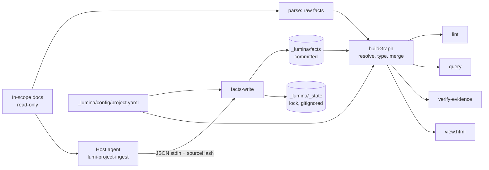

# Architecture Spine — project-docs-overlay

## Design Paradigm

**Pipes-and-filters over file contracts, with a read-only source layer.** In-scope docs are the source; nothing in Lumina writes them. Two extractors feed two stores: a deterministic parse (raw, untyped) and host-agent ingest through `facts-write` (committed facts). One `buildGraph()` merges both, resolves references, and types relations; lint, query, evidence verify, and the viewer consume only its output. Every stage boundary is a file or a JSON-over-Bash call; skills never import engine code. The engine is a self-contained tree, separate from the classic `src/scripts/` engine.



## Inherited Invariants

Binding, read-only; from `docs/project-context.md` §3 (PC) and `SPEC-project-docs-overlay`.

| Inherited | From | Binds here |
| --- | --- | --- |
| atomicWrite for every write; safePath for user-supplied relative paths, including scope globs | PC §3.1–2, `source-scope.md` | every writer, `project.yaml` scope patterns |
| Exit codes 0/1/2/3/4; JSON to stdout, `{error,code}` to stderr | PC §3.7 | `project.mjs`, installer |
| Lazy imports; cold start under 300 ms | PC §3.8 | `--mode project` path, viewer generation |
| No native modules, no postinstall | PC §3.4–5 | all new code |
| Soft cap 3,000 LoC original JS | PC §3.23 | already exceeded by the classic engine; project modules stay single-purpose |
| Empty devDependencies; `node --test` only | root `CLAUDE.md` | all new tests |
| Zero telemetry; no network at runtime | PC §3.22 | viewer loads nothing remote |
| No emoji; plain-language user text; en/vi/zh doc sync | PC §3.18/21/24 | skills, installer prompts, docs |
| Docs are the only source of truth; the graph holds typed relations, pointers, and evidence quotes, never prose; concept nodes hold name, aliases, mentions only | SPEC constraints, `ontology.md` | every writer, `buildGraph()` |
| Lumina calls no LLM API; hooks never invoke an agent | SPEC constraints | hook, engine |
| Lint keys only on governance meta-types and generic relation rules; setup guidance is domain-neutral | SPEC constraints | `ontology.mjs`, lint, `lumi-project-setup` |
| Classic and AI-agent installs stay byte-identical | SPEC constraints | installer branch, AD-5 isolation |

## Invariants & Rules

### AD-1 — Source layer is read-only `[ADOPTED]`

- **Binds:** all
- **Prevents:** Lumina becoming a second writer of project docs.
- **Rule:** No engine subcommand writes an in-scope file. The installer writes only its marker blocks (AD-3), and the parser strips those blocks before reading. The only other doc edits are made by the host agent after the user approves each one: frontmatter fixes during setup, or a new file such as a glossary.

### AD-2 — Install mode is explicit, detected, and fixed per repo `[ADOPTED]`

- **Binds:** CAP-1
- **Prevents:** one repo holding classic and project layouts; silent mode switches; a teammate's re-install asking the wrong question.
- **Rule:** `lumina install --mode project`. A committed `_lumina/config/project.yaml` or `_lumina/project/install.json` (`{schemaVersion, packageVersion, ideTargets}`, written by the installer because the manifest is gitignored) means project mode: plain `lumina install` there runs a project upgrade, and `--mode classic` exits 3. Without it, the default is `classic` and an interactive fresh install asks classic vs project first. `MANIFEST_SCHEMA_VERSION` goes 4 → 5, adding `mode`, with a migration that defaults to `classic`. The project branch diverges early in `installCommand` like `--agents`, never scaffolds `raw/`/`wiki/`, and never calls `renderIdeStubs`. `--mode project` with `--packs` or `--agents` exits 1. `lumina wikis` commands and `findEnclosingWorkspace` read `mode` and skip or refuse project-mode repos.

### AD-3 — User-owned files change only inside Lumina marker blocks `[ADOPTED]`

- **Binds:** CAP-1
- **Prevents:** overwriting a project's `AGENTS.md`, `CLAUDE.md`, or `.gitignore`; line-ending churn outside the block.
- **Rule:** A new installer helper, parameterized by marker name, replaces or appends the region between `<!-- lumina:project -->` and `<!-- /lumina:project -->` and preserves the file's existing line endings. Classic `replaceSchemaRegion` is unchanged. An absent entry file is created holding only the block. `.gitignore` gets a `# >>> lumina` … `# <<< lumina` block holding `_lumina/graph/`, `_lumina/_state/`, `_lumina/manifest.json`, replaced in place.

### AD-4 — Project skill set and host targets `[ADOPTED]`

- **Binds:** CAP-3, CAP-6, CAP-9, CAP-10, CAP-11, CAP-12
- **Prevents:** canonical-id collisions with classic skills; one command name with two behaviors.
- **Rule:** Project mode installs only `lumi-project-*` skills (setup, ingest, ask, check, verify, view); classic packs are not offered. Shared skill context lives in `_lumina/project/PROJECT.md` (engine commands, ontology summary, rules), rendered by the installer; the `lumina:project` block and every `lumi-project-*` skill point there, not to the project's `README.md`. `antigravity` is a project-mode target only, using `.agents/skills/` and `AGENTS.md`. Project-mode targets in v1: `claude_code`, `codex`, `antigravity`.

### AD-5 — Self-contained engine tree owns all Lumina state

- **Binds:** CAP-2, CAP-5, CAP-6, CAP-8, CAP-9, CAP-10, CAP-11, CAP-12
- **Prevents:** project code shipping into classic installs (`copyScripts` copies every file in `src/scripts/` and `src/scripts/lib/`); skills writing Lumina state with divergent formats.
- **Rule:** All project-mode engine code lives in `src/project/` (`project.mjs`, `ontology.mjs`, `lib/`, `vendor/`) and installs to `_lumina/project/` by an explicit copy list that exits 3 on any missing file; every path is in `package.json` `files` and `ci-package` `requiredFiles`. Nothing is added to `src/scripts/`. Engine writers replace named files and never clear a directory. `project.mjs` is the sole writer of `_lumina/facts/`, `_lumina/graph/`, `_lumina/_state/`; skills call it via Bash and never import it. Subcommands: `scope`, `status`, `facts-write`, `build`, `query`, `lint`, `verify-evidence`, `view`, `config-check`.

### AD-6 — Engine is zero-dependency `[ADOPTED]`

- **Binds:** all engine code
- **Prevents:** scripts failing in project repos and CI that have no Lumina `node_modules`.
- **Rule:** `_lumina/project/**` imports only `node:` builtins and modules inside `_lumina/project/`. The only vendored module it imports is js-yaml 4.1.1 (`vendor/js-yaml.mjs`, ESM, MIT). The viewer library is read as text and inlined (AD-16), never imported. `project.mjs` checks `process.versions.node` >= 24 and exits 3 with a message otherwise.

### AD-7 — Meta-ontology is pure data, separate from classic schema

- **Binds:** CAP-4, CAP-9
- **Prevents:** lint keyed on project type names; classic `schemas.mjs` drifting under project changes.
- **Rule:** `src/project/ontology.mjs` exports `META_TYPES`, `META_RELATIONS`, and `RULES` (every finding id the engine emits, each with an owner: a meta-relation or `engine`), with no I/O. An emitted id missing from `RULES` fails the tests. Every project type and relation resolves to a meta-type or meta-relation inside `buildGraph()`; an unmapped relation becomes `references`.

### AD-8 — Project config is one YAML file, agent-written, engine-validated

- **Binds:** CAP-2, CAP-3, CAP-4
- **Prevents:** scope, mapping, and ID patterns split across files that disagree; a hand-rolled YAML parser; setup guidance biased to software.
- **Rule:** `_lumina/config/project.yaml`, parsed by the vendored js-yaml (AD-6), holds `schemaVersion`, scope globs, ID patterns, type-to-meta-type map, `related:` pair rules, status sources, external ID patterns, and concept vocabulary. The setup skill or the user writes it; the engine never does. Every subcommand validates it on load (`safePath` on globs, every type mapped to a known meta-type, no two in-scope paths equal after case-folding) and exits 2 with the error list; `config-check` is that validation alone. The setup skill proposes only types the scan finds and maps each to a meta-type without assuming software doc names, ID schemes, or folders.

### AD-9 — One scope matcher

- **Binds:** CAP-2, CAP-5, CAP-8, CAP-9
- **Prevents:** subcommands disagreeing on which files are in scope.
- **Rule:** `src/project/lib/scope.mjs` is the only scope implementation. It carries its own `*`/`**` glob compiler with a parity test against classic `matchGlob` on a shared fixture list, applies always-excluded (`.git/`, `node_modules/`, `_lumina/`) and default-excluded paths from `source-scope.md`, and passes every pattern through `safePath`. Every subcommand selects files through it.

### AD-10 — Fact file envelope `[ADOPTED]`

- **Binds:** CAP-6, CAP-9, CAP-11
- **Prevents:** unreadable diffs, merge conflicts beyond the edited doc, churn from re-ingest.
- **Rule:** One file per source doc at `_lumina/facts/<repo-relative source path>.json`, written only by `facts-write`, which replaces the doc's entire fact set per call (the ingest skill makes one call per doc). Envelope `{schemaVersion, source, sourceHash, ontologyVersion, facts[]}`; pretty JSON, fixed key order, facts sorted by `id`. A fact file whose source is gone but whose `sourceHash` matches a new in-scope doc is a rename-candidate finding, never moved automatically. Facts with an older `ontologyVersion` are marked for re-ingest; nothing is auto-deleted. `facts-prune [--dry-run]` removes, on explicit request only, every fact file whose source is not an in-scope doc, except rename candidates.

### AD-11 — References are kept as written, resolved at build

- **Binds:** CAP-6, CAP-7, CAP-9, CAP-10
- **Prevents:** the parser and the agent choosing incompatible reference formats; one document appearing as two nodes.
- **Rule:** Every fact keeps `ref` exactly as written. `buildGraph()` resolves in order: declared project ID, `path#anchor`, path, concept alias, external ID pattern, else a dangling-reference finding. Every node id carries a prefix: `doc:<path>`, `frag:<path>#<anchor>`, `id:<ID>`, `concept:<slug>`. A declared ID (one per doc: frontmatter `id` first, else the H1) is an alias that resolves to its defining `doc:` or `frag:` node; `id:<ID>` nodes exist only for IDs with no single definition (external, undeclared, or declared twice).

### AD-12 — Freshness is computed live, never written to committed files `[ADOPTED]`

- **Binds:** CAP-5, CAP-8
- **Prevents:** a stored stale list disagreeing with a live check; docs re-ingested forever; near-total re-ingest when docs churn.
- **Rule:** Content hash = sha256 of file bytes after stripping a leading BOM and normalizing CRLF and lone CR to LF (`lib/hash.mjs`); it is a hint, not the validity test. Each in-scope doc is `fresh` (hash equals `sourceHash`), `changed` (hash differs, every fact still passes the AD-22 evidence match and its ref still resolves), `stale` (a fact fails either check, or `ontologyVersion` differs), or `never-ingested`, always computed live; skills select docs through `status --json`. A doc with nothing to extract gets `facts: []` and counts as ingested.

### AD-13 — No host hook in v1 `[RETIRED]`

- **Binds:** CAP-3, CAP-8
- **Prevents:** merging Lumina entries into user-owned host settings for no correctness gain.
- **Rule:** Lumina registers no host hook. Every read parses live (AD-19), and a hook cannot refresh agent facts because hooks never invoke an agent. Revisit only when a measured read exceeds 1 s.

### AD-14 — Lint is agent-free and report-only

- **Binds:** CAP-9
- **Prevents:** CI needing an agent; lint editing docs; rules with no owner.
- **Rule:** `project.mjs lint` runs `buildGraph()` over committed facts plus a fresh parse. Rule ids `P<nn>` come only from `RULES` (AD-7): relation rules owned by meta-relations, plus engine rules for dangling reference, duplicate declared ID, external ID pattern, unmapped type, stale facts (warning), broken evidence (error), rename candidate (info). Output keys exactly `{schemaVersion, checks_run[], findings[{id, severity, file, line, message}], summary{errors, warnings, infos}}`. `--fail-on error|warning` (default `error`); exit 0 below that level, 1 at or above it. No `--fix`.
- **Exit codes, all subcommands:** 1 bad arguments; 2 invalid config, missing root, path-safety violation, case-fold collision; 3 internal error, lock timeout, newer `schemaVersion`.

### AD-15 — Consumers read through the engine

- **Binds:** CAP-10, CAP-11, CAP-12, CAP-6
- **Prevents:** skills parsing fact or graph files and drifting from build-time resolution.
- **Rule:** Skills read graph state only through `project.mjs` subcommand output (`status`, `query`, `verify-evidence`, `view`), never from `_lumina/facts/` or `_lumina/graph/`. Ask then reads the cited doc sections to answer content, and searches in-scope docs when no node matches; every claim cites `file:line`.

### AD-16 — Viewer is one inlined HTML file

- **Binds:** CAP-12
- **Prevents:** network loads, `file://` fetch failures, React or build steps entering the package.
- **Rule:** Only `project.mjs view` writes `_lumina/graph/view.html`, with `force-graph` 1.51.4 UMD and graph data both inlined. Inlined JSON escapes `<`, `>`, `&`, U+2028, U+2029 as `\uXXXX`. Data stays repo-relative; editor links derive the absolute root from `location.pathname` at view time. The library is vendored at `src/project/vendor/force-graph.min.js` with a combined third-party notice (force-graph MIT plus its bundled d3 licenses, and js-yaml MIT) and installed with the engine. Viewer code is lazily imported.

### AD-17 — Uninstall keeps committed knowledge `[ADOPTED]`

- **Binds:** CAP-1
- **Prevents:** uninstall destroying ingest results the team paid for.
- **Rule:** Uninstall branches on `manifest.mode` before any classic step. Project-mode uninstall strips the entry-file and `.gitignore` marker blocks and the `lumi-project-*` skills, and removes `_lumina/` except `facts/` and `config/`, which it deletes only on explicit confirmation. User entry files are never recorded in `files-manifest.csv`. It never touches in-scope docs or host settings files.

### AD-18 — One fact record shape

- **Binds:** CAP-5, CAP-6, CAP-7, CAP-9, CAP-11
- **Prevents:** parse and agent facts, or edge and status facts, using incompatible shapes; ids that change with spelling.
- **Rule:** `src/project/lib/fact.mjs` defines `{id, kind: "edge"|"attr", subject, relation, object | value, ref, scope?, evidence{line, quote}, provenance: "extracted"|"inferred"}`; parse and `facts-write` both build records through it. `facts-write` canonicalizes `subject`/`object` against the current parse (falling back to the written form), then sets `id` = first 16 hex chars of sha256 over canonical JSON `[kind, relation, subject, object|value, scope]`.

### AD-19 — One `buildGraph()` resolves, types, merges, and sets status

- **Binds:** CAP-5, CAP-6, CAP-9, CAP-10, CAP-12
- **Prevents:** consumers building different graphs; parse typing relations without the resolver; `references` and typed edges double-counting; two owners of document status.
- **Rule:** `src/project/lib/graph.mjs` `buildGraph()` is the only resolver and typer; parse emits raw relation names. Edges merge by resolved `(from, metaRelation, to)`, dropping a `references` edge when a typed edge exists for the pair and keeping all evidence. Document status comes only from the configured status source; agent facts may set status only on fragments; a document-level conflict is a finding. Every read parses the in-scope docs and builds the graph in memory; nothing is cached until a measured read is too slow. Output is byte-identical on unchanged input (sorted keys and records, no timestamps).

### AD-20 — Fragment and concept identity come from the parse and the config

- **Binds:** CAP-6, CAP-7
- **Prevents:** the agent inventing anchors the parse never produces; Vietnamese headings slugging differently; concepts minted in two places.
- **Rule:** Fragments are heading anchors (one GitHub-compatible, Unicode-preserving slug function in `src/project/lib/markdown.mjs`) and declared-ID definition sites. `facts-write` rejects unknown anchors and unknown concepts; finer spans such as a status-table row go in `scope` as a quote. A declared ID defined twice is a finding and resolves to neither. Concepts exist only in the `project.yaml` vocabulary. Provisional mention matcher: NFC, case-insensitive, word-boundary match on name and aliases, no diacritic folding, fenced code skipped.

### AD-21 — `ontologyVersion` is computed

- **Binds:** CAP-4, CAP-6
- **Prevents:** hand-edited versions that miss a mapping change.
- **Rule:** The engine computes `ontologyVersion` as a hash of the ontology-relevant `project.yaml` sections (type map, relation rules, vocabulary, status sources).

### AD-22 — Evidence is checked at write and verify with one function

- **Binds:** CAP-6, CAP-11
- **Prevents:** hallucinated quotes being committed; `facts-write` and `verify-evidence` disagreeing on a match.
- **Rule:** `src/project/lib/evidence.mjs` matches a quote after NFC and whitespace collapse as a substring of the source. `facts-write` requires the caller's `sourceHash`, rejects a mismatch with the current file, rejects quotes not found, and recomputes `line` as the first matching line.

### AD-23 — Single writer at a time

- **Binds:** CAP-6, CAP-8
- **Prevents:** two `facts-write` calls racing on the same fact file.
- **Rule:** `facts-write` takes `_lumina/_state/lock` (exclusive create; stale after 30 s), retries up to 10 s, then exits 3. The engine's atomicWrite uses unique temp names (pid + random).

### AD-24 — Commit matrix and version skew

- **Binds:** CAP-1, CAP-9
- **Prevents:** timestamps and absolute paths in the team repo; CI lacking engine files; an older engine rewriting newer data.
- **Rule:** Committed: `_lumina/project/`, `_lumina/config/project.yaml`, `_lumina/facts/`, `lumi-project-*` skills in host skill dirs. Gitignored: `_lumina/graph/`, `_lumina/_state/`, `_lumina/manifest.json`. No `_lumina/schema/` in project mode. The engine refuses to write a fact file or config whose `schemaVersion` is newer than it knows (exit 3); the installer refuses to replace a committed `_lumina/project/` whose `install.json` names a newer version (exit 3).

### AD-25 — Engine root discovery

- **Binds:** all engine subcommands
- **Prevents:** subcommands run from a subdirectory reading the wrong tree.
- **Rule:** `project.mjs` resolves the repo root by walking up from cwd to the nearest `_lumina/config/project.yaml`; with none found it exits 2. All paths it reads or writes are relative to that root.

### AD-26 — Classic isolation and project tests are CI gates

- **Binds:** CAP-1, CAP-5
- **Prevents:** project code leaking into classic installs; nondeterministic parse output going unnoticed.
- **Rule:** CI asserts a classic install contains no `_lumina/project/`. `ci-idempotency` gains a project-mode scenario that includes a CRLF `AGENTS.md`. Project tests are co-located `*.test.mjs` under `src/project/`, registered in a `test:project` script, run on synthetic fixtures in `src/project/test-fixtures/` (excluded from the package), and include a parse-determinism test. Seli, Capigo, and KEPs pilots are manual acceptance, not CI.

### AD-27 — Partial supersession is scoped

- **Binds:** CAP-6, CAP-9
- **Prevents:** lint flagging every citer of a partly replaced decision; ingest inventing a new label per citer.
- **Rule:** A `supersedes` fact with no `scope` and a `doc:` target is full; one with a `scope` label or a `frag:` target is partial. P03 flags every citer of a fully superseded doc, and for a partial one only a citer pointing at the superseded fragment or holding a fact on the same target with the same `scope`. Ingest copies `scope` labels verbatim from engine output. The Decision lifecycle adds `partially-superseded`; P02 accepts `superseded` or `partially-superseded` for a partial target.

### AD-28 — Fixed query operations

- **Binds:** CAP-7, CAP-10
- **Prevents:** a query language the ask skill and engine interpret differently.
- **Rule:** `query node <ref>` resolves an ID, path, or concept alias and returns the node with its in and out edges; `query list --meta-type T [--status S]` filters nodes; `query neighbors <ref> --direction in|out [--relation R]` walks one hop. Every returned item carries `file:line` and quote; every response carries `freshness{stale, changed, neverIngested, staleDocs[]}`. No path search or full-text.

```mermaid
flowchart TD
  skills[lumi-project-* skills] -->|Bash + JSON| cli[_lumina/project/project.mjs]
  cli --> graph[lib/graph.mjs buildGraph]
  cli --> fact[lib/fact.mjs]
  graph --> fact
  cli --> lib[lib: scope, markdown, frontmatter, hash, evidence, fsx]
  graph --> onto[ontology.mjs]
  installer["installer (mode project)"] -->|copy list| cli
  installer -->|renders| ctx[_lumina/project/PROJECT.md]
  skills -->|read| ctx
```

The engine tree imports no npm package and nothing from the classic `src/scripts/` engine, and the classic engine imports nothing from it.

## Consistency Conventions

| Concern | Convention |
| --- | --- |
| Naming | Skills `lumi-project-<verb>`; engine `project.mjs <subcommand>`; lint ids `P<nn>`; meta-types PascalCase (`Decision`), meta-relations kebab-case (`depends-on`) |
| Paths | Repo-relative, forward slashes, no leading `./`, in every file Lumina writes |
| Data | Config in YAML; engine-written files JSON with fixed key order; every file carries `schemaVersion`; dates ISO 8601 UTC; hashes lowercase hex sha256 |
| Errors | `{error, code}` on stderr; codes per the inherited exit-code contract |
| Writes | Engine atomicWrite with unique temp names; engine is the only writer of `_lumina/{facts,graph,_state}` |
| Evidence | Verbatim quote plus 1-based line; line recomputed by `facts-write` |

## Stack

| Name | Version |
| --- | --- |
| Node.js | >= 24 |
| force-graph (vendored UMD) | 1.51.4 |
| js-yaml (vendored ESM) | 4.1.1 |
| commander (installer only) | ^12.1.0 |
| @clack/prompts (installer only) | ^0.9.1 |

## Structural Seed

```text
package: src/
  project/project.mjs                 # engine CLI (AD-5)
  project/ontology.mjs                # meta-ontology, pure data (AD-7)
  project/lib/{scope,fact,graph,markdown,frontmatter,hash,evidence,fsx}.mjs
  project/vendor/{force-graph.min.js,js-yaml.mjs}   # + third-party notice (AD-6, AD-16)
  project/test-fixtures/              # not packaged (AD-26)
  skills/project/lumi-project-*/SKILL.md
  installer/commands.js               # --mode project branch (AD-2)

project repo after install:
  committed:  _lumina/project/  _lumina/config/project.yaml  _lumina/facts/  lumi-project-* skills
  gitignored: _lumina/graph/  _lumina/_state/  _lumina/manifest.json
  AGENTS.md / CLAUDE.md               # lumina:project block only
```

## Capability → Architecture Map

| Capability | Lives in | Governed by |
| --- | --- | --- |
| CAP-1 install mode | `installer/commands.js` project branch | AD-2, AD-3, AD-17, AD-24, AD-26 |
| CAP-2 source scope | `lib/scope.mjs`, `project.yaml` | AD-8, AD-9 |
| CAP-3 setup skill | `lumi-project-setup` | AD-1, AD-8 |
| CAP-4 two-tier ontology | `ontology.mjs`, `project.yaml` | AD-7, AD-8, AD-21 |
| CAP-5 deterministic parse | `lib/parse.mjs`, `lib/graph.mjs` | AD-9, AD-12, AD-18, AD-19 |
| CAP-6 agent ingest | `lumi-project-ingest` + `facts-write` | AD-10, AD-18, AD-20, AD-22, AD-23 |
| CAP-7 node granularity | `buildGraph()` | AD-11, AD-20 |
| CAP-8 freshness | `status`, live parse | AD-12, AD-13, AD-19 |
| CAP-9 cross-doc lint | `project.mjs lint` | AD-7, AD-14, AD-19, AD-27 |
| CAP-10 ask | `lumi-project-ask` + `query` | AD-15, AD-19, AD-28 |
| CAP-11 evidence verify | `verify-evidence` | AD-15, AD-22 |
| CAP-12 graph view | `project.mjs view` | AD-16, AD-19 |

## Deferred

- A parsed/graph cache and a host hook (AD-13): revisit when a measured read exceeds 1 s.

- Project-mode support for `cursor`, `gemini_cli`, `qwen`, `iflow`, `generic`: add when a pilot needs one (AD-4).
- Consolidating classic `wiki.mjs`/`lint.mjs` parsers with the project libs: touches classic installs.
- Final concept mention matching rules (homonyms, mixed-language aliases): the AD-20 provisional matcher is revised after the Seli false-positive measurement.
- Mermaid diagram parsing into Process steps: agent ingest covers it.
- Scale beyond about 5,000 in-scope docs (incremental parse, sharded cache): no pilot is near it.
- Fact-file merge-conflict helper: per-doc files make conflicts rare.
- `lumi-hub` registration, Obsidian export, 3D viewer: spec non-goals.
- Ingest cost budgeting and batching: host agents own token spend; revisit after the Seli pilot.
- Older installers (1.14 and earlier) run in a project repo see no manifest and would do a classic install; mitigated only by the `lumina:project` block naming the minimum version.
- Deployment and operations: none beyond the npm package and the project's own CI running `node _lumina/project/project.mjs lint`.
