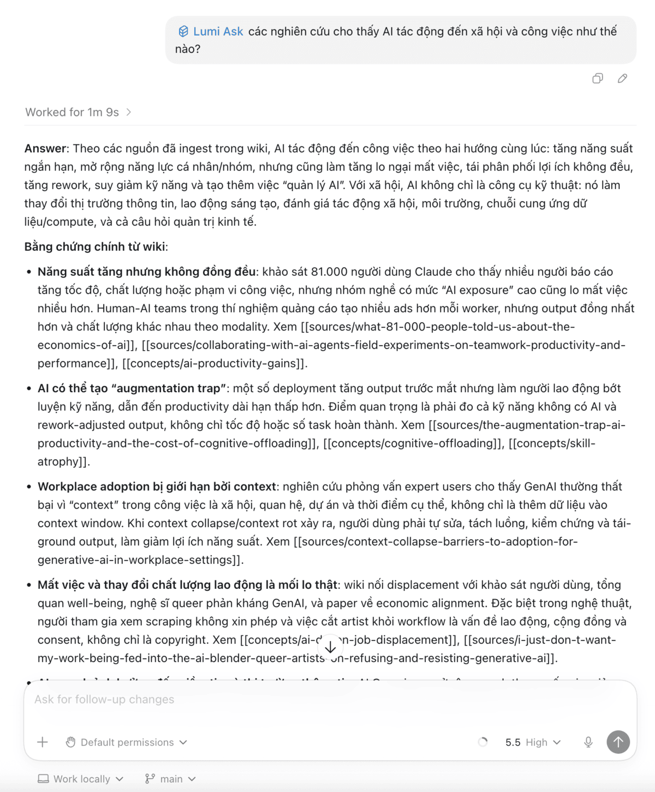
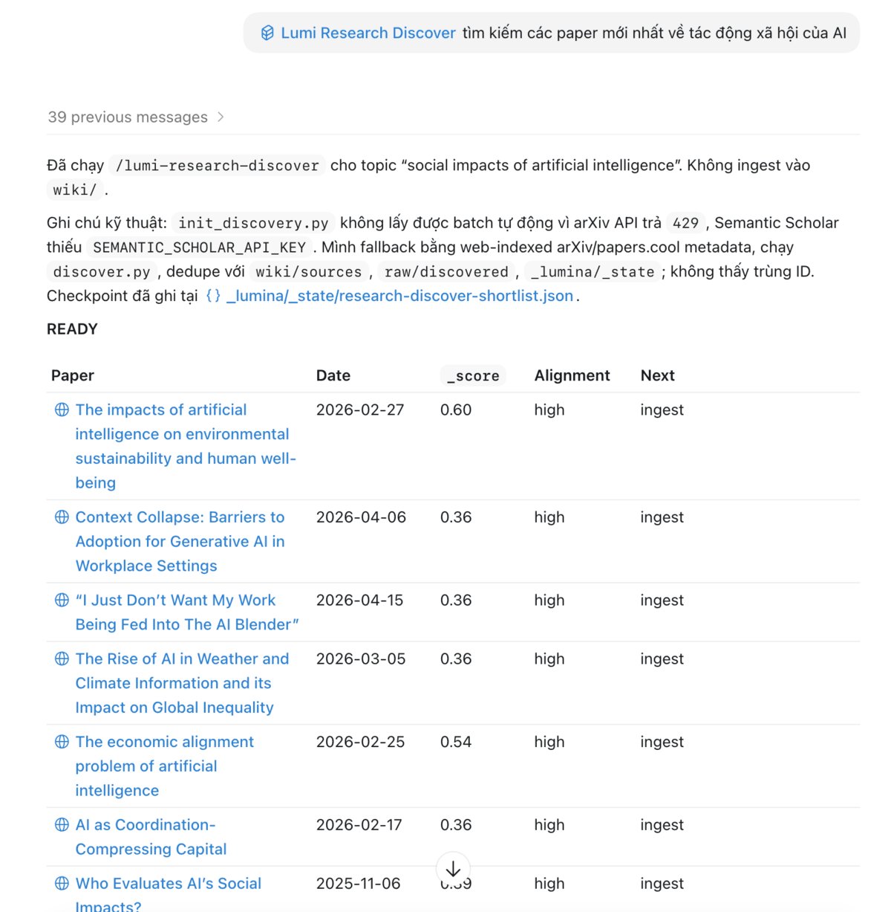
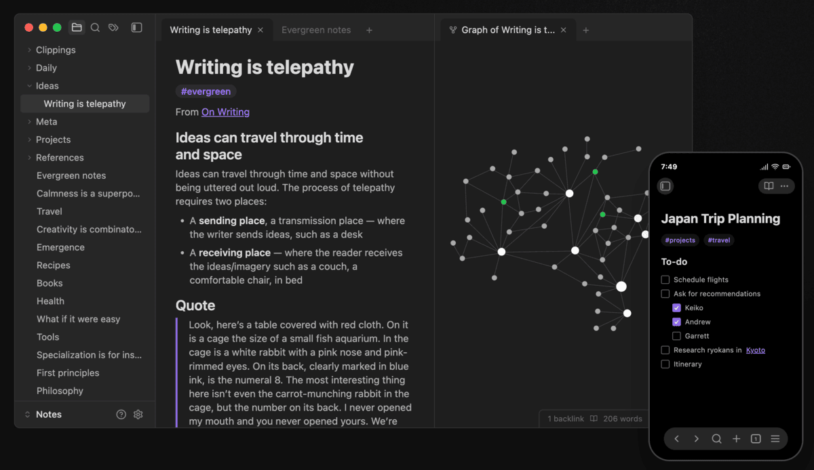

# Lumina-Wiki User Guide

Lumina-Wiki helps you turn AI into a personal knowledge assistant: you put documents, notes, papers, or articles in one fixed place; AI reads, summarizes, organizes, links, and maintains them as a wiki you can ask about later.

You can think of Lumina-Wiki as a "second brain" for reading and research. The difference is that you do not have to write every note from scratch. AI does the heavy work: reading sources, extracting main ideas, creating concept pages, recording links between documents, and keeping the wiki structured.

Your role is to choose sources, ask questions, check the direction of the analysis, and decide what matters. The AI's role is to take care of the knowledge area in `wiki/`: writing new pages, updating old pages, keeping links, updating the index, writing the log, and helping the wiki stay consistent as it grows.

## Contents

- [Problems With the Old Way of Managing Knowledge](#problems-with-the-old-way-of-managing-knowledge)
- [What Can You Use Lumina-Wiki For?](#what-can-you-use-lumina-wiki-for)
- [How Does Lumina-Wiki Work?](#how-does-lumina-wiki-work)
- [Installation](#installation)
- [How to Call Commands in an AI Agent](#how-to-call-commands-in-an-ai-agent)
- [Quick Start](#quick-start)
- [Research Pack for Research Work](#research-pack-for-research-work)
- [Common Commands](#common-commands)
- [Using Codex App, Claude Code, and Gemini CLI](#using-codex-app-claude-code-and-gemini-cli)
- [Using Obsidian to Read the Wiki](#using-obsidian-to-read-the-wiki)
- [Upgrading Lumina-Wiki](#upgrading-lumina-wiki)
- [Frequently Asked Questions](#frequently-asked-questions)
- [A Suggested Workflow for Researchers](#a-suggested-workflow-for-researchers)

## Problems With the Old Way of Managing Knowledge

When you only have a few documents, you can save them in a folder, bookmark them in a browser, or write a few lines in a note-taking app. But when the number of documents grows, this usually creates many problems:

- **Documents are scattered:** PDFs are in the downloads folder, links are in the browser, notes are in a note-taking app, and key ideas are in chat history.
- **You read something but cannot reuse it easily:** you remember reading an important document, but you do not remember where it is or what the main point was.
- **Notes are not connected:** one idea may appear in many documents, but you have to remember which document said what and how they relate to each other.
- **New documents do not update old understanding:** when you read a new source, you have to update old notes yourself, add contradictions, add evidence, and add links.
- **It is hard to write an overview:** when you need to write a report, thesis, plan, or presentation, you have to gather information from many places and organize it again from the start.
- **Personal wikis are easy to abandon:** at first you may take careful notes, but as documents grow, naming, sectioning, linking, and updating become tiring.
- **Using AI as separate chats still makes you start over often:** if you only upload files into one chat, AI can answer at that moment, but useful analysis often disappears into chat history and does not become a maintained knowledge base.

Lumina-Wiki solves this by letting AI take care of the wiki. You still decide which sources matter and which questions are worth following, but AI helps turn documents into a structured knowledge area and keeps maintaining it over time.

## What Can You Use Lumina-Wiki For?

Lumina-Wiki is useful when you have many documents and want to turn them into a knowledge base you can ask again later. Here are some specific use cases.

### 1. Build a personal knowledge library

You read books, articles, reports, newsletters, personal notes, or podcast transcripts. You may not be working on a formal research topic, but you still want what you read to stay useful after a few days.

Lumina-Wiki fits when you want one place to keep main ideas, sources, open questions, and links between things you have read. Over time, the wiki becomes a personal memory store: you can return to see what you have read, which topics repeat often, and which ideas are worth exploring further.

This is a good fit for self-learners, people who read a lot but do not take notes regularly, or people who want to build a "second brain" without manually maintaining every note.

### 2. Managers and company operators

You need to read many types of documents: market reports, customer feedback, meeting notes, competitor documents, internal strategy, industry analysis, and new policies. The problem is not only storage, but turning them into insight you can use for decisions.

Lumina-Wiki fits when you often need to ask: what are customers complaining about most, how are competitors changing direction, which risks keep appearing, and which opportunities have strong enough evidence. The wiki helps AI keep the source of each claim, connect scattered signals, and maintain a shared picture as new documents appear.

This is useful for founders, product managers, strategy, operations, marketing, sales, or anyone who needs to turn many information sources into clear decisions.

### 3. Teachers and curriculum designers

You have textbooks, slides, reference materials, learning outcomes, exercises, student feedback, practical examples, and extra reading sources. As the course grows, it becomes harder to remember which lesson relates to which concept, which example has been used, and where students often get stuck.

Lumina-Wiki fits when you want to build a knowledge base for a course or training program: main concepts, explanatory sources, examples, common misunderstandings, links between lessons, what should be taught first, and where more material is needed.

This is especially useful when you update the curriculum often. New material can be added to the wiki so AI can help link it with old lessons, instead of leaving everything scattered across many folders.

### 4. Students

You have textbooks, slides, readings, class notes, review outlines, and reference materials. Each file may make sense on its own, but when it is time to study for an exam or write a paper, you need to see how they connect.

Lumina-Wiki fits if you often feel "I have read this, but I do not know where to start reviewing." The wiki helps collect the important parts of each document, create concept pages, connect related lessons, and keep the summaries you have asked for.

This is useful for long-term study: final exam review, essays, thesis preparation, language learning, difficult courses, or self-learning a new skill.

### 5. Researchers

You work with academic papers, monographs, technical reports, supporting data, experiment notes, draft ideas, and related sources. You need more than summaries of individual sources; you need to see how sources build on, add to, or challenge each other.

Lumina-Wiki fits long-term research because the wiki can grow source by source. When you add a new document, AI can help update old concepts, record contradictions, and link authors, methods, evidence, and research gaps.

This is where Research Pack is especially valuable: finding related sources, pre-creating foundational concepts, choosing documents worth reading, and creating an overview from what the wiki already knows.

## How Does Lumina-Wiki Work?

Lumina-Wiki uses two main areas:

- `raw/`: where you put original documents.
- `wiki/`: the knowledge area that AI takes care of and maintains. This is where AI creates notes, summaries, concepts, people profiles, answers, and the links between them.

In short: `raw/` is your source library; `wiki/` is the knowledge brain that AI helps you write and keep tidy over time.

Example:

```text
You put a document in raw/sources/
        ↓
You ask AI to read it with lumi-ingest
        ↓
AI creates a summary page in wiki/sources/
        ↓
AI updates concepts, related people, links, the index, and the log
        ↓
You ask again with lumi-ask
```

You do not need to remember the full internal structure. In everyday use, you only need to remember:

- original documents go in `raw/`,
- processed knowledge lives in `wiki/`,
- you work with Lumina-Wiki through commands named `lumi-*`. Depending on the AI tool, you may call them with `/` or `$`.

## Installation

Open a terminal in the project you want to use as a wiki, then run:

```bash
npx lumina-wiki install
```

The installer will ask you a few questions, such as whether you want to install extra packs like `research` or `reading`.

If you use Windows, the README recommends enabling Developer Mode so the installer can use symlinks better. If you do not enable it, Lumina-Wiki can still use file copying as a fallback.

## How to Call Commands in an AI Agent

Lumina-Wiki commands are named `lumi-*`, for example `lumi-ingest`, `lumi-ask`, and `lumi-research-discover`.

The command syntax depends on the AI tool you use:

| Tool | Example syntax |
| --- | --- |
| Codex App | `$lumi-ingest raw/sources/tai-lieu.pdf` |
| Claude Code | `/lumi-ingest raw/sources/tai-lieu.pdf` |
| Gemini CLI | `/lumi-ingest raw/sources/tai-lieu.pdf` |

Most examples below use `/lumi-*` syntax. If you use Codex App, change `/` to `$`.

## Quick Start

### 1. Put a document in `raw/sources/`

For example, suppose you have a file:

```text
bao-cao-giao-duc.pdf
```

Put it here:

```text
raw/sources/bao-cao-giao-duc.pdf
```

### 2. Ask AI to add the document to the wiki

In your chat window with the AI agent, run:

```text
/lumi-ingest raw/sources/bao-cao-giao-duc.pdf
```

If you use Codex App, call the skill with `$`:

```text
$lumi-ingest raw/sources/bao-cao-giao-duc.pdf
```

AI will read the document, create a summary page in `wiki/sources/`, and create related pages if needed.

### 3. Ask your knowledge base

After you have a few documents in the wiki, you can ask:

```text
/lumi-ask What common problems are these documents discussing?
```

Or:

```text
/lumi-ask Compare the main ideas of the three most recent documents.
```

Lumina-Wiki helps AI answer based on the knowledge already added to `wiki/`, instead of only relying on the temporary memory of one chat.

An important answer can also become a new page in the wiki. This means reading, comparison, and analysis results are not lost in chat history. They keep accumulating in the shared knowledge area.



Example in Codex App: AI answers based on the knowledge base that Lumina-Wiki has built.

## Research Pack for Research Work

Research Pack is very useful if you use Lumina-Wiki for research, especially when you need to find related documents, filter sources, build a conceptual foundation, or write an overview from what you have read.

Research Pack has four main commands:

| Command | What it is for |
| --- | --- |
| `/lumi-research-setup` | Prepare the research environment, check Python tools, and help configure API keys if needed. |
| `/lumi-research-discover` | Find and rank research sources related to the topic you provide. |
| `/lumi-research-prefill` | Pre-create foundation pages for common concepts, so later reading links more consistently. |
| `/lumi-research-survey` | Create a research overview from the sources and concepts already in the wiki. |

### When should you use Research Pack?

Use Research Pack when you are doing things like:

- finding new documents for a topic,
- choosing which documents are worth reading first,
- building background knowledge for a field,
- pre-creating basic concepts so later reading does not drift in meaning or naming,
- summarizing the documents you have read into an overview,
- finding gaps or disagreements between sources.

### Example research workflow

Suppose you want to research "the impact of phone use in the classroom".

First, configure the research tools:

```text
/lumi-research-setup
```

Next, it is useful to pre-create a few foundation concepts:

```text
/lumi-research-prefill phone use in the classroom
```

```text
/lumi-research-prefill student attention level
```

This step gives AI a shared concept layer before reading many documents. When sources use different names for the same idea, the wiki can link them into the same knowledge foundation more easily, instead of creating many separate pages or drifting in interpretation.

Then ask Lumina-Wiki to find sources:

```text
/lumi-research-discover impact of phone use in the classroom
```

This command creates a list of candidates for you to review. It does not automatically turn every result into a wiki page. You choose which documents are worth reading, then ingest each source:



Example in Codex App: Research Pack suggests new research sources for you to review before adding them to the wiki.

```text
/lumi-ingest <document or source you choose>
```

When the wiki has some sources, you can ask:

```text
/lumi-ask What do these documents say about the impact of phones on attention?
```

Or create an overview:

```text
/lumi-research-survey phone use in the classroom
```

The important point: Research Pack helps you expand and organize the research process. Adding a specific source to the wiki still goes through `/lumi-ingest`, so the wiki keeps clear structure, links, and logs.

For long-term research, the biggest value is accumulation: each new source is not only summarized on its own, but can also clarify old concepts, add sources for an argument, or show contradictions with what the wiki recorded earlier.

### Useful research questions

```text
/lumi-ask Which documents have the most reliable evidence?
```

```text
/lumi-ask Where do the authors disagree?
```

```text
/lumi-ask Which idea groups are mentioned by many sources?
```

```text
/lumi-ask If I write the literature review section, what idea groups should I divide it into?
```

```text
/lumi-research-survey Summarize the main directions in this field and identify research gaps.
```

## Common Commands

The examples below use `/lumi-*` syntax, which fits environments that use slash commands. If you use Codex App, change `/lumi-*` to `$lumi-*`, for example `/lumi-ingest` to `$lumi-ingest`.

| Command | Simple meaning |
| --- | --- |
| `/lumi-init` | Prepare the initial wiki structure and scan what is already in `raw/`. |
| `/lumi-ingest <file or source>` | Add a document to the wiki. This is the command you will use very often. |
| `/lumi-ask <question>` | Ask the knowledge base created in `wiki/`. |
| `/lumi-edit <wiki page>` | Ask AI to edit or update a specific wiki page. |
| `/lumi-check` | Ask AI to check wiki health: structure errors, broken links, or pages that were not updated correctly. |
| `/lumi-reset` | Delete or reset part of the wiki in a controlled way. |
| `/lumi-verify` | Ask AI to check that your wiki notes actually match the sources you cited. |

## Checking your notes with /lumi-verify

When AI summarizes a document into a wiki page, it can sometimes add things that are not in the original source. `/lumi-verify` reads each note in your wiki and tells you which statements do not match the sources you cited.

### When to use it

- After AI adds new pages to your wiki, before you rely on them.
- Before you share or export part of the wiki.
- Once in a while, as a health check on older pages.

### How to use it

```text
/lumi-verify <page-name>     # check one page
/lumi-verify --all            # check all pages
```

### What you get back

A short report listing any statement in your notes that does not match the cited source. For each one, the report tells you:

- Which statement looks suspicious.
- Why (for example: "this number does not appear in the cited paper").
- A suggestion (rewrite, remove, or keep with a note).

`/lumi-verify` never edits your notes for you. You decide what to do with each finding.

## Using Codex App, Claude Code, and Gemini CLI

Lumina-Wiki is not a separate chat app. It is a folder structure, scripts, and commands that let an AI agent work inside your project.

With tools like Codex App, Claude Code, or Gemini CLI, the general workflow is:

1. Open the correct project folder where Lumina-Wiki is installed.
2. Chat with the AI agent inside that project.
3. Call Lumina commands using the syntax supported by that tool.

### Codex App

[Codex](https://openai.com/codex) is OpenAI's coding agent. When using it with Lumina-Wiki, open the project where Lumina-Wiki is installed in Codex App, then call skills with `$`.

Example:

```text
$lumi-ingest raw/sources/bao-cao-giao-duc.pdf
```

```text
$lumi-ask What common problems are these documents discussing?
```

This guide does not describe every button in Codex App, because the app interface may change. The important part is that Codex needs to work in the correct project folder, where `AGENTS.md`, `README.md`, `raw/`, `wiki/`, and `_lumina/` are located.

### Claude Code

With Claude Code, open the project where Lumina-Wiki is installed and use `/lumi-*` commands in the chat. Lumina-Wiki has an entry file for Claude Code so the agent knows to read the README and use the installed skills correctly.

### Gemini CLI

With Gemini CLI, open a terminal in the project where Lumina-Wiki is installed, then chat with Gemini in that same folder. Lumina-Wiki has an entry file for Gemini CLI so the agent understands the wiki structure and Lumina commands.

## Using Obsidian to Read the Wiki

[Obsidian](https://obsidian.md/) is a note-taking app that stores your notes as Markdown files on your computer and helps you link notes together.

Because Lumina-Wiki creates Markdown files, you can open the project folder with Obsidian if you want to read and browse the wiki more easily. The README recommends opening the **project root folder**, not only the `wiki/` folder.



Image source: [obsidian.md](https://obsidian.md/)

## Upgrading Lumina-Wiki

When you want to upgrade Lumina-Wiki in an existing project, run again:

```bash
npx lumina-wiki install
```

The installer will update scripts, schemas, and skills. Your knowledge content in `wiki/`, original documents in `raw/`, and existing log are preserved.

If an old wiki is missing some new metadata fields, the installer may warn you. In that case, you can run:

```text
/lumi-migrate-legacy
```

This command helps AI read the changelog and add missing information to old pages in a controlled way.

## Frequently Asked Questions

### Do I need to know programming?

You do not need to know programming to use Lumina-Wiki at a basic level. You need to know how to open a terminal, run the install command, put files in the right folder, and chat with an AI agent.

### Where should I put files?

Main documents such as PDFs, papers, reports, and transcripts should go in:

```text
raw/sources/
```

Personal notes can go in:

```text
raw/notes/
```

### Should I edit files in `wiki/` by hand?

You can, but be careful. `wiki/` is the knowledge area where AI maintains structure, links, and metadata. If you want to edit a page, the better way is to use:

```text
/lumi-edit <wiki page path>
```

### I just added a document to `raw/`. Why does `/lumi-ask` not know it yet?

Because the original document is only in `raw/`. Add it to the wiki with:

```text
/lumi-ingest raw/sources/<file-name>
```

After that, `/lumi-ask` can use the processed knowledge in `wiki/`.

### What is an API key?

An API key is a key string issued by an external service, for example Semantic Scholar or DeepXiv. Research Pack can use some API keys to find better sources or increase access limits. Do not put API keys in files you plan to commit or share publicly.

### Does Obsidian replace Lumina-Wiki?

No. Obsidian is a note-taking app. Lumina-Wiki is a system that helps AI read documents and create a structured wiki. The two tools can be used together, but they have different roles.

## A Suggested Workflow for Researchers

1. Install Lumina-Wiki and choose Research Pack.
2. Run `/lumi-research-setup` to check research tools.
3. Use `/lumi-research-prefill` for foundational concepts in the field.
4. Put the documents you already have in `raw/sources/`.
5. Run `/lumi-ingest` for each important document.
6. Use `/lumi-research-discover` to find more related sources.
7. Choose sources worth reading and ingest them.
8. Use `/lumi-ask` to ask questions, compare sources, and find gaps.
9. Use `/lumi-research-survey` to create an overview from what the wiki already knows.
10. Open the project with Obsidian if you want to read and browse Markdown notes more conveniently.

Lumina-Wiki becomes more useful when you use it regularly. Each well-ingested document makes your knowledge brain clearer, more connected, and easier to ask again. You do not only get one more summary; you get one more piece of knowledge that AI maintains inside a shared system.
