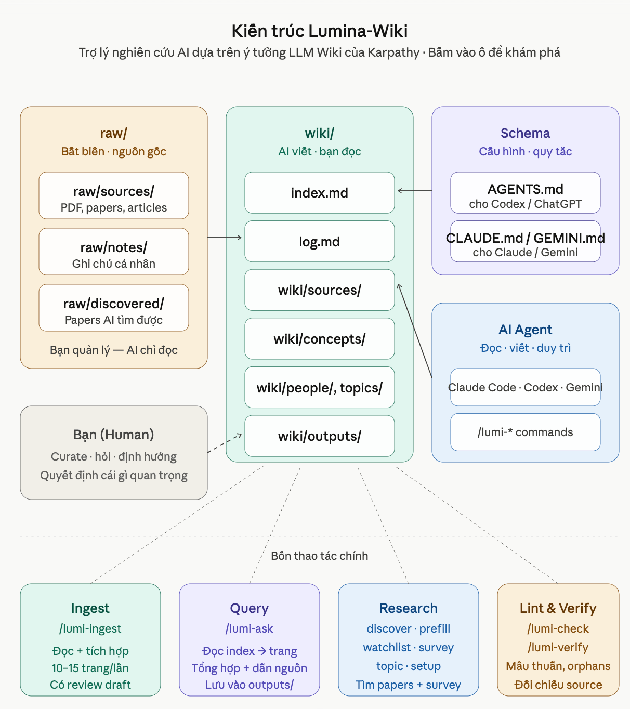

# Hướng dẫn sử dụng Lumina-Wiki

Lumina-Wiki giúp bạn biến AI thành một trợ lý tri thức cá nhân: bạn đưa tài liệu, ghi chú, bài báo hoặc bài viết vào một nơi cố định; AI đọc, tóm tắt, sắp xếp, liên kết và duy trì chúng thành một wiki mà bạn có thể hỏi lại về sau.

Bạn có thể xem Lumina-Wiki như một "bộ não thứ hai" cho việc đọc và nghiên cứu. Điểm khác biệt là bạn không phải tự viết mọi ghi chú từ đầu. AI sẽ làm phần nặng: đọc nguồn, rút ý chính, tạo trang khái niệm, ghi lại liên kết giữa các tài liệu, và giữ wiki có cấu trúc.

Vai trò của bạn là chọn nguồn, đặt câu hỏi, kiểm tra hướng phân tích và quyết định điều gì quan trọng. Vai trò của AI là chăm sóc khu vực tri thức trong `wiki/`: viết trang mới, cập nhật trang cũ, giữ liên kết, cập nhật mục lục, ghi log và giúp wiki nhất quán khi nó lớn dần.

## Mục Lục

- [Làm Quen Với /lumi-help — Hướng dẫn viên thông minh của bạn](#làm-quen-với-lumi-help--hướng-dẫn-viên-thông-minh-của-bạn)
- [Những Vấn Đề Khi Quản Lý Tri Thức Theo Cách Cũ](#những-vấn-đề-khi-quản-lý-tri-thức-theo-cách-cũ)
- [Bạn Có Thể Dùng Lumina-Wiki Để Làm Gì?](#bạn-có-thể-dùng-lumina-wiki-để-làm-gì)
- [Lumina-Wiki Hoạt Động Như Thế Nào?](#lumina-wiki-hoạt-động-như-thế-nào)
- [Cài Đặt](#cài-đặt)
- [Cách Gọi Lệnh Trong AI Agent](#cách-gọi-lệnh-trong-ai-agent)
- [Bắt Đầu Nhanh](#bắt-đầu-nhanh)
- [Research Pack Cho Công Việc Nghiên Cứu](#research-pack-cho-công-việc-nghiên-cứu)
- [Các Lệnh Thường Dùng](#các-lệnh-thường-dùng)
- [Dùng Với OpenAI CodexApp (ChatGPT), Claude Code, Gemini CLI](#dùng-với-openai-codexapp-chatgpt-claude-code-gemini-cli)
- [Dùng Obsidian Để Đọc Wiki](#dùng-obsidian-để-đọc-wiki)
- [Nâng Cấp Lumina-Wiki](#nâng-cấp-lumina-wiki)
- [Câu Hỏi Thường Gặp](#câu-hỏi-thường-gặp)
- [Một Workflow Gợi Ý Cho Người Làm Nghiên Cứu](#một-workflow-gợi-ý-cho-người-làm-nghiên-cứu)
- [Nâng cao: Tìm tài liệu định kỳ](advanced-scheduled-discovery.vi.md)
- [Nâng cao: Tăng tốc tìm kiếm với QMD](advanced-qmd.vi.md)

## Làm Quen Với /lumi-help — Hướng dẫn viên thông minh của bạn

`/lumi-help` là lệnh đáng nhớ nhất, trước cả những lệnh khác.

Quên mất mình đang làm gì? Gõ `/lumi-help`. Mở project ra, không biết bắt đầu từ đâu? Gõ `/lumi-help`. Muốn xem hết những gì Lumina-Wiki làm được? `/lumi-help skills`.

```text
/lumi-help            # một bước kế tiếp, dựa trên wiki của bạn lúc này
/lumi-help skills     # toàn bộ danh sách lệnh đang được cài
```

Bạn cứ hình dung nó như một hướng dẫn viên đã quen project của bạn:

- Nó liếc vào `raw/` và `wiki/`, xem việc bạn vừa làm gần nhất.
- Nó chọn nước đi hợp lý nhất — thường là một lệnh, kèm dòng để bạn copy thẳng.
- Thêm `skills` thì nó liệt kê đủ mọi lệnh bạn có, gom theo từng pack (Core, Research, Reading).

Phần còn lại của hướng dẫn này nói Lumina-Wiki *là gì* và *làm gì*. Cài xong rồi, bạn gần như không cần nhớ *dùng thế nào* — đó là việc của `/lumi-help`.

## Những Vấn Đề Khi Quản Lý Tri Thức Theo Cách Cũ

Khi tài liệu còn ít, bạn có thể lưu trong một thư mục, đánh dấu sao trong trình duyệt, hoặc ghi vài dòng vào ứng dụng ghi chú. Nhưng khi tài liệu tăng lên, cách làm này thường gặp nhiều vấn đề:

- **Tài liệu bị rải rác:** PDF nằm trong thư mục tải xuống, link nằm trong trình duyệt, ghi chú nằm trong ứng dụng ghi chú, còn ý chính nằm trong lịch sử chat.
- **Đọc xong nhưng khó dùng lại:** bạn nhớ là đã từng đọc một tài liệu quan trọng, nhưng không nhớ nằm ở đâu hoặc ý chính là gì.
- **Ghi chú không liên kết với nhau:** một ý xuất hiện trong nhiều tài liệu, nhưng bạn phải tự nhớ tài liệu nào nói gì và chúng liên quan nhau ra sao.
- **Tài liệu mới không cập nhật hiểu biết cũ:** khi đọc thêm nguồn mới, bạn phải tự sửa lại ghi chú cũ, thêm mâu thuẫn, thêm bằng chứng, thêm liên kết.
- **Khó viết tổng quan:** đến lúc cần viết báo cáo, luận văn, kế hoạch, hoặc bài trình bày, bạn phải gom lại từ nhiều nơi và tự sắp xếp lại từ đầu.
- **Wiki cá nhân dễ bị bỏ hoang:** ban đầu bạn có thể ghi chép rất kỹ, nhưng càng nhiều tài liệu thì việc đặt tên, chia mục, tạo liên kết và cập nhật trở nên mệt.
- **Dùng AI theo kiểu chat rời rạc vẫn dễ phải bắt đầu lại:** nếu chỉ tải file lên một cuộc chat, AI có thể trả lời lúc đó, nhưng phần phân tích hay thường biến mất trong lịch sử chat và không trở thành một kho tri thức được duy trì.

Lumina-Wiki giải quyết vấn đề này bằng cách để AI phụ trách phần chăm sóc wiki. Bạn vẫn quyết định nguồn nào quan trọng và câu hỏi nào đáng theo đuổi, nhưng AI giúp biến tài liệu thành một khu vực tri thức có cấu trúc và tiếp tục duy trì nó theo thời gian.

## Bạn Có Thể Dùng Lumina-Wiki Để Làm Gì?

Lumina-Wiki hữu ích khi bạn có nhiều tài liệu và muốn biến chúng thành một kho tri thức có thể hỏi lại. Dưới đây là một số tình huống sử dụng cụ thể.

### 1. Xây một thư viện tri thức cá nhân

Bạn đọc sách, bài viết, báo cáo, bản tin, ghi chú cá nhân hoặc bản chép lời podcast. Có thể bạn không làm một đề tài chính thức nào, nhưng vẫn muốn những gì mình đọc không bị trôi mất sau vài ngày.

Lumina-Wiki phù hợp nếu bạn muốn có một nơi để giữ lại ý chính, nguồn gốc, câu hỏi còn bỏ ngỏ và các liên kết giữa những điều bạn đã đọc. Theo thời gian, wiki trở thành một kho nhớ cá nhân: bạn có thể quay lại để xem mình đã đọc gì, chủ đề nào lặp lại nhiều lần, ý tưởng nào đáng đào sâu hơn.

Tình huống này rất hợp với người tự học, người đọc nhiều nhưng không ghi chép đều, hoặc người muốn xây một "bộ não thứ hai" mà không phải tự chăm sóc từng ghi chú bằng tay.

### 2. Quản lý, người điều hành công ty

Bạn phải đọc nhiều loại tài liệu: báo cáo thị trường, phản hồi khách hàng, ghi chú họp, tài liệu đối thủ, chiến lược nội bộ, phân tích ngành, chính sách mới. Vấn đề không chỉ là lưu trữ, mà là biến chúng thành nhận định có thể dùng để ra quyết định.

Lumina-Wiki phù hợp nếu bạn thường phải hỏi: khách hàng đang phàn nàn gì nhiều nhất, đối thủ đang đổi hướng ra sao, rủi ro nào xuất hiện lặp lại, cơ hội nào có bằng chứng đủ mạnh. Wiki giúp AI giữ lại nguồn gốc của từng nhận định, kết nối các tín hiệu rải rác và duy trì một bức tranh chung khi tài liệu mới xuất hiện.

Tình huống này hợp với nhà sáng lập, quản lý sản phẩm, người làm chiến lược, vận hành, marketing, bán hàng hoặc bất kỳ ai phải biến nhiều nguồn thông tin thành quyết định rõ ràng.

### 3. Giáo viên, người thiết kế chương trình

Bạn có giáo trình, slide, tài liệu tham khảo, chuẩn đầu ra, bài tập, phản hồi của học viên, ví dụ thực tế và các nguồn đọc thêm. Khi chương trình học lớn dần, việc nhớ bài nào liên quan đến khái niệm nào, ví dụ nào đã dùng, phần nào học viên hay vướng trở nên khó hơn.

Lumina-Wiki phù hợp nếu bạn muốn xây một kho tri thức cho môn học hoặc chương trình đào tạo: khái niệm chính, nguồn giải thích, ví dụ, lỗi hiểu nhầm thường gặp, mối liên hệ giữa các bài, phần nào nên dạy trước, phần nào cần bổ sung tài liệu.

Tình huống này đặc biệt hữu ích khi bạn phải cập nhật chương trình thường xuyên. Tài liệu mới có thể được đưa vào wiki để AI giúp liên kết với bài học cũ, thay vì để mọi thứ nằm rời trong nhiều thư mục.

### 4. Học sinh, sinh viên

Bạn có giáo trình, slide, bài đọc, ghi chú trên lớp, đề cương ôn tập và tài liệu tham khảo. Mỗi file có thể hiểu riêng lẻ, nhưng đến lúc ôn thi hoặc viết bài, bạn cần thấy chúng nối với nhau như thế nào.

Lumina-Wiki phù hợp nếu bạn hay gặp cảm giác "mình đã đọc rồi nhưng không biết bắt đầu ôn từ đâu". Wiki giúp tích lũy phần quan trọng của từng tài liệu, tạo các trang khái niệm, nối các bài học liên quan và giữ lại những bản tóm tắt bạn đã yêu cầu.

Tình huống này hợp với việc học dài ngày: ôn thi cuối kỳ, làm tiểu luận, chuẩn bị khóa luận, học ngoại ngữ, học một môn khó hoặc tự học một kỹ năng mới.

### 5. Người nghiên cứu

Bạn làm việc với bài báo khoa học, sách chuyên khảo, báo cáo kỹ thuật, dữ liệu phụ trợ, ghi chú thí nghiệm, bản nháp ý tưởng và các nguồn liên quan. Bạn không chỉ cần tóm tắt từng nguồn, mà cần thấy các nguồn đang xây dựng, bổ sung hoặc phản biện nhau như thế nào.

Lumina-Wiki phù hợp với nghiên cứu dài hạn vì wiki có thể tích lũy dần theo từng nguồn. Khi thêm tài liệu mới, AI có thể giúp cập nhật khái niệm cũ, ghi nhận mâu thuẫn, liên kết tác giả, phương pháp, bằng chứng và khoảng trống nghiên cứu.

Tình huống này là nơi Research Pack phát huy nhiều giá trị: tìm nguồn liên quan, tạo trước khái niệm nền tảng, chọn tài liệu đáng đọc, và tạo bản tổng quan từ những gì wiki đã biết.

## Lumina-Wiki Hoạt Động Như Thế Nào?

Lumina-Wiki dùng hai khu vực chính:

- `raw/`: nơi bạn đặt tài liệu gốc.
- `wiki/`: khu vực tri thức do AI phụ trách chăm sóc và duy trì. Đây là nơi AI tạo ghi chú, tóm tắt, khái niệm, hồ sơ người, câu trả lời và các liên kết giữa chúng.

Nói ngắn gọn: `raw/` là thư viện nguồn của bạn; `wiki/` là bộ não tri thức mà AI giúp bạn viết và giữ cho gọn gàng theo thời gian.

Ví dụ:

```text
Bạn đặt tài liệu vào raw/sources/
        ↓
Bạn yêu cầu AI đọc bằng lumi-ingest
        ↓
AI tạo trang tóm tắt trong wiki/sources/
        ↓
AI cập nhật khái niệm, người liên quan, liên kết, mục lục và log
        ↓
Bạn hỏi lại bằng lumi-ask
```

Bạn không cần nhớ toàn bộ cấu trúc bên trong. Trong sử dụng hằng ngày, bạn chỉ cần nhớ:

- tài liệu gốc để trong `raw/`,
- kiến thức đã được xử lý nằm trong `wiki/`,
- bạn làm việc với Lumina-Wiki bằng các lệnh tên `lumi-*`. Tùy công cụ AI, bạn có thể gọi chúng bằng dấu `/` hoặc dấu `$`.

<p align="center">
  
</p>

## Cài Đặt

Việc cài đặt Lumina-Wiki rất đơn giản. Bạn chỉ cần chuẩn bị một vài thứ và sau đó chạy một lệnh duy nhất để bắt đầu một "cuộc trò chuyện" ngắn với trình cài đặt.

### Bạn cần chuẩn bị gì?

1.  **Node.js**: Đây là môi trường để Lumina-Wiki hoạt động, giống như bạn cần một trình phát media để xem video.
    *   **Cách làm**: Tải và cài đặt phiên bản "LTS" từ trang web chính thức: [nodejs.org](https://nodejs.org).

2.  **(Tùy chọn) Chế độ Nhà phát triển cho Windows**: Nếu bạn dùng Windows, việc bật chế độ này sẽ giúp Lumina-Wiki chạy nhanh hơn một chút.
    *   **Cách làm**: Vào phần Cài đặt của Windows, tìm "Developer Mode" (Chế độ nhà phát triển) và bật nó lên.
    *   ***Lưu ý quan trọng***: *Nếu bạn bỏ qua bước này, mọi thứ vẫn hoạt động bình thường!* Trình cài đặt sẽ tự động sao chép các tệp cần thiết thay vì tạo lối tắt (symlink).

### Các bước cài đặt

1.  **Mở Terminal**:
    *   Đây là một chương trình trên máy tính để bạn gõ lệnh vào. Trên **macOS** hoặc **Linux**, nó tên là **Terminal**. Trên **Windows**, nó là **Command Prompt** hoặc **PowerShell**.

2.  **Tạo và đi đến thư mục mới**:
    *   Tạo một thư mục trống ở nơi bạn muốn lưu trữ wiki của mình (ví dụ: trong thư mục `Documents`).
    *   Trong cửa sổ terminal, gõ `cd` (viết tắt của "change directory"), một dấu cách, sau đó kéo thư mục bạn vừa tạo vào cửa sổ terminal và nhấn Enter.

3.  **Chạy lệnh cài đặt**:
    *   Sao chép và dán lệnh sau vào terminal rồi nhấn Enter:
    ```bash
    npx lumina-wiki install
    ```
    *   **`npx` là gì?** Nó là một công cụ tiện lợi đi kèm với Node.js, giúp bạn chạy lệnh `lumina-wiki install` mà không cần cài đặt nó vĩnh viễn vào máy tính của bạn.

### Trả lời các câu hỏi của trình cài đặt

Sau khi chạy lệnh, trình cài đặt sẽ bắt đầu một "cuộc trò chuyện" ngắn để thiết lập không gian làm việc cho bạn. Bạn chỉ cần trả lời vài câu hỏi đơn giản:

1.  **Thư mục cài đặt (Installation directory)**: Nhấn **Enter** để xác nhận cài đặt trong thư mục hiện tại. Đây là lựa chọn được khuyến nghị.
2.  **Mục đích sử dụng (Research purpose)**: Mô tả ngắn gọn chủ đề bạn quan tâm (ví dụ: "Nghiên cứu về AI" hoặc "Ghi chú sách marketing"). Điều này giúp AI hiểu ngữ cảnh làm việc của bạn.
*   **Công cụ AI (IDE targets)**: Chọn các công cụ chat AI bạn đang dùng. **OpenAI CodexApp (ChatGPT)** là một lựa chọn rất thuận tiện cho người mới vì nó có giao diện ứng dụng riêng. Ngoài ra bạn có thể chọn các công cụ mạnh mẽ khác như Gemini CLI, Claude Code, v.v. Dùng phím **Mũi tên** để di chuyển và phím **Cách (Space)** để chọn.
4.  **Gói tính năng (Packs)**: Chọn các kỹ năng bổ sung như `research` (cho nghiên cứu khoa học) hoặc `reading` (cho đọc sách). Các tính năng cốt lõi đã được bao gồm sẵn và không cần chọn.
5.  **Ngôn ngữ (Languages)**: Nhập "Tiếng Việt" để AI trao đổi và tạo ghi chú bằng tiếng Việt.

### Hoàn tất

Khi bạn thấy dòng chữ **[done]** màu xanh lá, mọi thứ đã sẵn sàng! Bạn có thể bắt đầu sử dụng Lumina-Wiki ngay lập tức.

### Nâng cấp hoặc thay đổi cài đặt

Nếu sau này bạn muốn thêm một gói tính năng hoặc thay đổi ngôn ngữ, chỉ cần chạy lại lệnh:
```bash
npx lumina-wiki install
```
Trình cài đặt sẽ nhận ra không gian làm việc đã có và chỉ hỏi những gì bạn muốn thay đổi. **Toàn bộ tài liệu và ghi chú của bạn sẽ được giữ nguyên.**

### Gỡ cài đặt

Nếu bạn không muốn sử dụng Lumina-Wiki nữa, hãy chạy lệnh sau trong thư mục dự án:
```bash
npx lumina-wiki uninstall
```
Lệnh này sẽ dọn dẹp các tệp hệ thống do Lumina-Wiki tạo ra. Nó sẽ **không bao giờ xóa** các tài liệu gốc của bạn trong `raw/` hoặc kho tri thức trong `wiki/` mà bạn đã dày công xây dựng.

## Cách Gọi Lệnh Trong AI Agent

Các lệnh của Lumina-Wiki có tên dạng `lumi-*`, ví dụ `lumi-ingest`, `lumi-ask`, `lumi-research-discover`.

Cú pháp gọi lệnh phụ thuộc vào công cụ AI bạn dùng:

| Công cụ | Cú pháp ví dụ |
| --- | --- |
| OpenAI CodexApp (ChatGPT) | `$lumi-ingest raw/sources/tai-lieu.pdf` |
| Claude Code | `/lumi-ingest raw/sources/tai-lieu.pdf` |
| Gemini CLI | `/lumi-ingest raw/sources/tai-lieu.pdf` |

Trong phần lớn ví dụ bên dưới, guide dùng cú pháp `/lumi-*`. Nếu bạn dùng OpenAI CodexApp (ChatGPT), hãy đổi dấu `/` thành `$`.

## Bắt Đầu Nhanh

### 1. Đặt tài liệu vào `raw/sources/`

Ví dụ bạn có một file:

```text
bao-cao-giao-duc.pdf
```

Hãy đặt nó vào:

```text
raw/sources/bao-cao-giao-duc.pdf
```

### 2. Yêu cầu AI đưa tài liệu vào wiki

Trong cửa sổ chat với AI agent, chạy:

```text
/lumi-ingest raw/sources/bao-cao-giao-duc.pdf
```

Nếu dùng OpenAI CodexApp (ChatGPT), gọi skill bằng dấu `$`:

```text
$lumi-ingest raw/sources/bao-cao-giao-duc.pdf
```

AI sẽ đọc tài liệu, tạo trang tóm tắt trong `wiki/sources/`, và tạo thêm các trang liên quan nếu cần.

### 3. Hỏi lại kho tri thức

Sau khi đã có vài tài liệu trong wiki, bạn có thể hỏi:

```text
/lumi-ask Các tài liệu này đang nói đến những vấn đề chung nào?
```

Hoặc:

```text
/lumi-ask Hãy so sánh ý chính của ba tài liệu gần đây nhất.
```

Lumina-Wiki giúp AI trả lời dựa trên phần kiến thức đã được đưa vào `wiki/`, thay vì chỉ dựa vào trí nhớ tạm thời của một cuộc chat.

Một câu trả lời quan trọng cũng có thể trở thành một trang mới trong wiki. Nhờ vậy, kết quả đọc, so sánh và phân tích không bị mất trong lịch sử chat mà tiếp tục tích lũy vào khu vực tri thức chung.

### 4. Bí? Gõ `/lumi-help`

Quên mất đang làm gì? Muốn xem hết các lệnh có sẵn? Cứ gõ:

```text
/lumi-help            # một bước kế tiếp
/lumi-help skills     # mọi lệnh đang được cài
```

Nó nhìn wiki của bạn rồi bảo bạn nên làm gì tiếp. Câu trả lời sẽ giống nhau dù bạn vừa cài xong, hay sáu tháng sau mới quay lại.


Ví dụ minh họa trong OpenAI CodexApp (ChatGPT): AI trả lời dựa trên kho tri thức đã được Lumina-Wiki xây dựng.

## Research Pack Cho Công Việc Nghiên Cứu

Research Pack là phần rất hữu ích nếu bạn dùng Lumina-Wiki cho nghiên cứu, đặc biệt khi bạn cần tìm tài liệu liên quan, lọc nguồn, xây nền khái niệm, hoặc viết tổng quan từ những gì đã đọc.

Research Pack có sáu lệnh chính:

| Lệnh | Dùng để làm gì |
| --- | --- |
| `/lumi-research-setup` | Chuẩn bị môi trường nghiên cứu, kiểm tra công cụ Python và hỗ trợ cấu hình API key nếu cần. |
| `/lumi-research-discover` | Tìm và xếp hạng các nguồn nghiên cứu liên quan đến chủ đề bạn đưa ra. |
| `/lumi-research-watchlist` | Giúp bạn chọn các chủ đề nghiên cứu để AI tìm định kỳ. |
| `/lumi-research-prefill` | Tạo trước các trang nền tảng cho khái niệm phổ biến, để các lần đọc sau liên kết ổn định hơn. |
| `/lumi-research-survey` | Tạo bản tổng quan nghiên cứu từ những nguồn và khái niệm đã có trong wiki. |
| `/lumi-research-topic` | Gom các khái niệm và nguồn đã có trong wiki vào một trang chủ đề riêng tại `wiki/topics/`. |

### Khi nào nên dùng Research Pack?

Dùng Research Pack khi bạn đang làm các việc như:

- tìm tài liệu mới cho một chủ đề,
- chọn tài liệu nào đáng đọc trước,
- xây nền kiến thức cho một lĩnh vực,
- tạo trước các khái niệm cơ bản để các lần đọc sau không bị lệch cách hiểu hoặc lệch cách gọi tên,
- tổng hợp những tài liệu đã đọc thành một bản tổng quan,
- tìm khoảng trống hoặc điểm bất đồng giữa các nguồn,
- gom một chủ đề hay lặp lại vào một trang riêng sau khi đã đưa đủ nguồn vào wiki.

### Quy trình nghiên cứu mẫu

Giả sử bạn muốn nghiên cứu về "ảnh hưởng của việc dùng điện thoại trong lớp học".

Trước tiên, cấu hình các công cụ nghiên cứu:

```text
/lumi-research-setup
```

Tiếp theo, nên tạo trước một vài khái niệm nền tảng:

```text
/lumi-research-prefill sử dụng điện thoại trong lớp học
```

```text
/lumi-research-prefill mức độ tập trung của học sinh
```

Bước này giúp AI có một lớp khái niệm chung trước khi đọc nhiều tài liệu. Khi các nguồn dùng cách gọi khác nhau cho cùng một ý, wiki sẽ dễ liên kết chúng vào cùng nền tri thức hơn, thay vì tạo nhiều trang rời rạc hoặc diễn giải lệch pha.

Sau đó, yêu cầu Lumina-Wiki tìm nguồn:

```text
/lumi-research-discover ảnh hưởng của việc dùng điện thoại trong lớp học
```

Lệnh này tạo danh sách bài báo hoặc tài liệu nghiên cứu để bạn xem xét. Nó không tự động biến mọi kết quả thành trang wiki. Bạn chọn tài liệu nào đáng đọc, rồi đưa từng nguồn vào wiki:


Ví dụ minh họa trong OpenAI CodexApp (ChatGPT): Research Pack gợi ý nguồn nghiên cứu mới để bạn xem xét trước khi đưa vào wiki.

Nếu bạn muốn Lumina-Wiki kiểm tra các chủ đề đã lưu định kỳ, hãy dùng
`/lumi-research-watchlist` để thiết lập chủ đề trước. Lịch chạy do máy của bạn
hoặc GitHub Actions gọi, không phải do AI tự thức dậy. Xem
[Nâng cao: Tìm tài liệu định kỳ](advanced-scheduled-discovery.vi.md) để có ví dụ
cài đặt cron, GitHub Actions, launchd, hoặc Windows Task Scheduler.

```text
/lumi-ingest <tài liệu hoặc nguồn bạn chọn>
```

Khi wiki đã có một số nguồn, bạn có thể hỏi:

```text
/lumi-ask Các tài liệu này nói gì về ảnh hưởng của điện thoại đến mức độ tập trung?
```

Hoặc tạo tổng quan:

```text
/lumi-research-survey sử dụng điện thoại trong lớp học
```

Khi đã đọc được nhiều nguồn và một chủ đề cứ xuất hiện lặp lại, bạn có thể gom nó thành một trang riêng:

```text
/lumi-research-topic sử dụng điện thoại trong lớp học
```

AI sẽ xem những gì đã có trong wiki, đề xuất danh sách các khái niệm và nguồn thuộc cụm chủ đề đó, rồi dừng để bạn xác nhận hoặc chỉnh sửa. Sau khi bạn đồng ý, trang được viết vào `wiki/topics/` và liên kết ngược từ mỗi khái niệm, mỗi nguồn về trang chủ đề được thêm tự động. Nếu một khái niệm hay nguồn chưa được đưa vào wiki, hãy chạy `/lumi-ingest` trước.

Ví dụ: bạn nói "tôi muốn gom mấy bài về RLHF thành một chủ đề". AI đề xuất sáu nguồn và bốn khái niệm. Bạn bỏ đi hai nguồn chỉ liên quan lỏng lẻo rồi xác nhận. Trang chủ đề được viết, linter chạy, và một ghi nhận được thêm vào log.

Điểm quan trọng: Research Pack giúp bạn mở rộng và tổ chức quá trình nghiên cứu. Việc đưa một nguồn cụ thể vào wiki vẫn đi qua `/lumi-ingest`, để wiki giữ được cấu trúc, liên kết và log rõ ràng.

Với nghiên cứu dài ngày, giá trị lớn nhất là sự tích lũy: mỗi nguồn mới không chỉ được tóm tắt riêng lẻ, mà còn có thể làm rõ khái niệm cũ, bổ sung nguồn cho một lập luận, hoặc chỉ ra điểm mâu thuẫn với những gì wiki đã ghi nhận trước đó.

### Ví dụ câu hỏi hay dùng khi nghiên cứu

```text
/lumi-ask Tài liệu nào có bằng chứng đáng tin cậy nhất?
```

```text
/lumi-ask Các tác giả đang bất đồng ở điểm nào?
```

```text
/lumi-ask Nhóm ý nào được nhiều nguồn nhắc đến nhất?
```

```text
/lumi-ask Nếu tôi viết phần tổng quan tài liệu, nên chia thành những nhóm ý nào?
```

```text
/lumi-research-survey Hãy tổng hợp các hướng chính trong lĩnh vực này và nêu khoảng trống nghiên cứu.
```

## Các Lệnh Thường Dùng

Các ví dụ dưới đây dùng cú pháp `/lumi-*`, phù hợp với các môi trường dùng slash command. Nếu dùng OpenAI CodexApp (ChatGPT), hãy đổi `/lumi-*` thành `$lumi-*`, ví dụ `/lumi-ingest` thành `$lumi-ingest`.

| Lệnh | Cách hiểu đơn giản |
| --- | --- |
| `/lumi-init` | Chuẩn bị cấu trúc wiki ban đầu và quét những gì đã có trong `raw/`. |
| `/lumi-ingest <file hoặc nguồn>` | Đưa một tài liệu vào wiki. Đây là lệnh bạn sẽ dùng rất thường xuyên. |
| `/lumi-ask <câu hỏi>` | Hỏi kho tri thức đã được tạo trong `wiki/`. |
| `/lumi-edit <trang wiki>` | Nhờ AI sửa hoặc cập nhật một trang wiki cụ thể. |
| `/lumi-check` | Nhờ AI kiểm tra sức khỏe wiki: lỗi cấu trúc, liên kết hỏng, hoặc trang chưa được cập nhật đúng. |
| `/lumi-reset` | Xóa hoặc đặt lại một phần wiki theo cách có kiểm soát. |
| `/lumi-verify` | Yêu cầu AI kiểm tra xem các trang wiki có thực sự khớp với nguồn bạn đã trích dẫn không. |
| `/lumi-help` | Nhờ AI gợi ý một bước kế tiếp dựa trên tình trạng wiki hiện tại. Thêm `skills` để xem toàn bộ lệnh. |

## Kiểm tra ghi chú với /lumi-verify

Khi AI tóm tắt một tài liệu thành trang wiki, đôi khi nó thêm vào những thông tin không có trong tài liệu gốc. `/lumi-verify` đọc từng trang trong wiki và chỉ cho bạn biết câu nào không khớp với nguồn bạn đã trích dẫn.

### Khi nào nên dùng

- Sau khi AI thêm trang mới vào wiki, trước khi bạn sử dụng các trang đó.
- Trước khi chia sẻ hoặc xuất một phần wiki.
- Định kỳ, để kiểm tra sức khỏe các trang cũ.

### Cách dùng

```text
/lumi-verify <tên-trang>     # kiểm tra một trang
/lumi-verify --all            # kiểm tra toàn bộ
```

### Bạn nhận được gì

Một bản báo cáo ngắn liệt kê những câu trong ghi chú không khớp với nguồn được trích dẫn. Với mỗi câu, báo cáo cho bạn biết:

- Câu nào đáng ngờ.
- Vì sao (ví dụ: "con số này không xuất hiện trong bài báo được trích dẫn").
- Gợi ý xử lý (sửa lại, xóa đi, hoặc giữ lại kèm chú thích).

`/lumi-verify` không bao giờ tự sửa ghi chú giúp bạn. Bạn quyết định xử lý từng phát hiện.

## Khi bạn lạc đường với /lumi-help

`/lumi-help` nhìn vào wiki bạn đang có và mách bạn đúng một việc nên làm tiếp — rất hữu ích khi bạn quên đang dừng ở đâu hoặc không chắc nên dùng lệnh nào. Nếu muốn xem tất cả những gì Lumina-Wiki làm được, thêm `skills` vào sau lệnh để xem danh sách đầy đủ.

### Khi nào nên dùng

- Bạn mở lại dự án sau một thời gian và không nhớ nên bắt đầu từ đâu.
- Bạn vừa thêm vài file vào `raw/` nhưng quên bước kế tiếp.
- Bạn muốn xem mọi lệnh có sẵn trong bản cài của mình (dùng `skills`).

### Cách dùng

```text
/lumi-help            # gợi ý một bước kế tiếp
/lumi-help skills     # xem mọi lệnh đang được cài
```

### Bạn nhận được gì

Ở chế độ mặc định: một lệnh được gợi ý, kèm lý do ngắn dựa trên tình trạng wiki hiện tại (ví dụ: "có ba file trong `raw/` chưa được nạp"), và dòng lệnh chính xác để chạy. Nếu wiki không hoạt động hơn một tháng, sẽ có thêm một dòng nhắc bạn chạy `/lumi-check` khi sẵn sàng — nhưng gợi ý chính vẫn tập trung vào việc tiếp tục công việc chứ không phải kiểm tra.

Ở chế độ `skills`: danh sách mọi lệnh được nhóm theo pack (Core, Research, Reading), mỗi lệnh kèm một câu mô tả ngắn. Phần của mỗi pack chỉ hiện ra nếu bạn đã cài pack đó.

## Thêm tài liệu với /lumi-ingest

`/lumi-ingest` đọc một tài liệu bạn chỉ định rồi viết trang wiki tương ứng. AI cho bạn xem bản nháp trước, sau đó chỉ hỏi lại khi thật sự cần quyết định của bạn.

### Khi nào nên dùng

- Khi bạn vừa có một tài liệu mới — PDF, bài viết, báo cáo — và muốn nó trở thành một phần của wiki.
- Khi bạn cần kiểm soát chặt hơn những gì được lưu vào wiki, đặc biệt với tài liệu quan trọng.
- Khi bạn muốn xem AI hiểu tài liệu như thế nào trước khi đồng ý lưu.

### Cách dùng

```text
/lumi-ingest <file hoặc URL>
```

Sau khi bạn gọi lệnh, AI sẽ đọc tài liệu và soạn một bản nháp trang wiki, rồi dừng lại để bạn xem. Bạn có thể đồng ý tiếp tục, yêu cầu chỉnh sửa, hoặc dừng lại để quay lại sau.

Nếu bạn đồng ý, AI tự kiểm tra các liên kết trong wiki và đối chiếu nội dung bản nháp với tài liệu gốc. Khi mọi thứ ổn, AI lưu trang và ghi lại vào nhật ký mà không bắt bạn duyệt từng bước bên trong. AI chỉ hỏi lại nếu phát hiện điểm đáng nghi, không thể tự sửa an toàn, không tìm thấy file nguồn, hoặc cần bạn đồng ý lưu trang với ghi chú độ tin cậy thấp.

Nếu dừng giữa chừng, tiến độ được giữ lại; chạy lại `/lumi-ingest` cho cùng tài liệu sẽ tiếp tục từ đúng chỗ bạn đã dừng.

### Bạn nhận được gì

- Một trang wiki mới nằm trong `wiki/sources/`, tóm tắt tài liệu bạn vừa đưa vào wiki.
- Các trang khái niệm, người, hoặc tổ chức được tạo tự động nếu tài liệu nhắc đến những thứ chưa có trong wiki.
- Liên kết hai chiều giữa trang mới và các trang đã có trong wiki.
- Mục lục wiki được cập nhật để phản ánh trang mới.
- Một ghi nhận trong log, để bạn biết tài liệu đó đã được đưa vào wiki khi nào và kết quả ra sao.
- Một dấu độ tin cậy thấp trên trang nếu bạn chọn lưu kèm điểm còn nghi ngờ, để sau này quay lại xem.

## Dùng Với OpenAI CodexApp (ChatGPT), Claude Code, Gemini CLI

Lumina-Wiki không phải một ứng dụng chat riêng. Nó là một bộ cấu trúc thư mục, script và lệnh để AI agent làm việc trong project của bạn.

Với các công cụ như OpenAI CodexApp (ChatGPT), Claude Code hoặc Gemini CLI, cách dùng chung là:

1. Mở đúng thư mục project đã cài Lumina-Wiki.
2. Chat với AI agent trong project đó.
3. Gọi các lệnh Lumina theo cú pháp mà công cụ đó hỗ trợ.

### OpenAI CodexApp (ChatGPT)

**OpenAI CodexApp** là một lựa chọn phổ biến cho người dùng Lumina-Wiki nhờ có giao diện ứng dụng riêng trực quan, giúp bạn quản lý các project tri thức một cách sinh động mà không cần làm việc hoàn toàn trong cửa sổ lệnh.

**Cách dùng:**
1. Mở ứng dụng CodexApp trên máy tính của bạn.
2. Chọn "Open Project" và trỏ đến thư mục bạn vừa cài đặt Lumina-Wiki.
3. Khi đã vào project, bạn có thể chat trực tiếp với AI. 
4. Các lệnh của Lumina-Wiki trong CodexApp bắt đầu bằng dấu `$`.

Ví dụ:
```text
$lumi-ingest raw/sources/tai-lieu.pdf
```

CodexApp sẽ tự động nhận diện file `AGENTS.md` trong thư mục để kích hoạt các "kỹ năng" của Lumina-Wiki. Đây là một trải nghiệm rất thân thiện cho cả người làm nghiên cứu lẫn người dùng phổ thông.

### Claude Code

Với Claude Code, mở project đã cài Lumina-Wiki và dùng các lệnh `/lumi-*` trong cuộc chat. Lumina-Wiki có entry file cho Claude Code để agent biết cần đọc README và dùng đúng các skill đã cài.

### Gemini CLI

Với Gemini CLI, mở terminal ở project đã cài Lumina-Wiki, sau đó chat với Gemini trong đúng thư mục đó. Lumina-Wiki có entry file cho Gemini CLI để agent hiểu cấu trúc wiki và các lệnh Lumina.

## Dùng Obsidian Để Đọc Wiki

[Obsidian](https://obsidian.md/) là ứng dụng ghi chú lưu ghi chú của bạn dưới dạng file Markdown trên máy và giúp bạn liên kết các ghi chú với nhau.

Vì Lumina-Wiki tạo các file Markdown, bạn có thể mở thư mục project bằng Obsidian nếu muốn đọc và duyệt wiki dễ hơn. README khuyến nghị mở **thư mục gốc của project**, không chỉ mở riêng thư mục `wiki/`.


Nguồn ảnh: [obsidian.md](https://obsidian.md/)

## Nâng Cấp Lumina-Wiki

Khi muốn nâng cấp Lumina-Wiki trong một project đã có sẵn, chạy lại:

```bash
npx lumina-wiki install
```

Installer sẽ cập nhật script, schema và skill. Nội dung tri thức của bạn trong `wiki/`, tài liệu gốc trong `raw/`, và log hiện có được giữ lại.

Nếu wiki cũ thiếu một số trường metadata mới, installer có thể cảnh báo. Khi đó bạn có thể chạy:

```text
/lumi-migrate-legacy
```

Lệnh này giúp AI đọc changelog và bổ sung thông tin còn thiếu cho các trang cũ theo cách có kiểm soát.

## Câu Hỏi Thường Gặp

### Tôi có cần biết lập trình không?

Không cần biết lập trình để dùng Lumina-Wiki ở mức cơ bản. Bạn cần biết cách mở terminal, chạy lệnh cài đặt, đặt file vào đúng thư mục, rồi chat với AI agent.

### Tôi nên bỏ file vào đâu?

Tài liệu chính như PDF, bài báo, report, transcript nên đặt trong:

```text
raw/sources/
```

Ghi chú cá nhân có thể đặt trong:

```text
raw/notes/
```

### Tôi có nên sửa file trong `wiki/` bằng tay không?

Có thể, nhưng nên cẩn thận. `wiki/` là khu vực tri thức mà AI phụ trách duy trì cấu trúc, liên kết và metadata. Nếu muốn sửa một trang, cách tốt hơn là dùng:

```text
/lumi-edit <đường dẫn trang wiki>
```

### Tôi vừa thêm tài liệu vào `raw/`, tại sao `/lumi-ask` chưa biết?

Vì tài liệu gốc mới chỉ nằm trong `raw/`. Hãy đưa nó vào wiki bằng:

```text
/lumi-ingest raw/sources/<tên-file>
```

Sau đó `/lumi-ask` mới có thể dùng phần kiến thức đã được xử lý trong `wiki/`.

### API key là gì?

API key là một chuỗi khóa do dịch vụ bên ngoài cấp, ví dụ Semantic Scholar hoặc DeepXiv. Research Pack có thể dùng một số API key để tìm nguồn tốt hơn hoặc tăng giới hạn truy cập. Không đưa API key vào file bạn định commit hoặc chia sẻ công khai.

### Obsidian có thay thế Lumina-Wiki không?

Không. Obsidian là app ghi chú. Lumina-Wiki là hệ thống giúp AI đọc tài liệu và tạo wiki có cấu trúc. Hai công cụ có thể dùng cùng nhau, nhưng vai trò khác nhau.

## Một Workflow Gợi Ý Cho Người Làm Nghiên Cứu

1. Cài Lumina-Wiki và chọn Research Pack.
2. Chạy `/lumi-research-setup` để kiểm tra công cụ nghiên cứu.
3. Dùng `/lumi-research-prefill` cho các khái niệm nền tảng của lĩnh vực.
4. Đặt các tài liệu đã có vào `raw/sources/`.
5. Chạy `/lumi-ingest` cho từng tài liệu quan trọng.
6. Dùng `/lumi-research-discover` để tìm thêm nguồn liên quan.
7. Chọn nguồn đáng đọc và đưa tiếp vào wiki.
8. Dùng `/lumi-ask` để hỏi, so sánh, tìm khoảng trống.
9. Dùng `/lumi-research-topic` để gom các chủ đề hay lặp lại vào trang riêng khi đã có đủ nguồn.
10. Dùng `/lumi-research-survey` để tạo bản tổng quan từ những gì wiki đã biết.
11. Mở project bằng Obsidian nếu muốn đọc và duyệt các ghi chú Markdown thuận tiện hơn.

Lumina-Wiki càng hữu ích khi bạn dùng nó đều đặn. Mỗi tài liệu được đưa vào wiki tốt sẽ làm bộ não tri thức của bạn rõ hơn, giàu liên kết hơn, và dễ hỏi lại hơn. Bạn không chỉ có thêm một bản tóm tắt; bạn có thêm một phần tri thức được AI chăm sóc trong một hệ thống chung.
